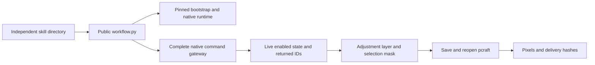

# PhotoCraft editable local adjustment and mask design

## Delivery contract

The 748-command reflection catalog alone does not prove first-use creative delivery. This change supplies paired native creation and source-revision plans to all twelve independent skills. Preserve project.pcraft, native.json, design.png, operations.json, manifest.json and exchange-loss.json. PNG flattening is an explicit exchange loss.

## Architecture

The change extends skill knowledge, plans, command references and tests. Research sources and native runtime remain unchanged. CodeGraph routes investigation to native new_adjustment, update_adjustment and Layer.mask; actual persistence is verified through the pinned public runtime.

## Scene and revision

A 128×64 scene contains Product [8,8,40,48] and Control [80,8,40,48]. Bind the returned brightnessContrast layer ID; select x=8,y=8,width=20,height=48 without feather or antialias, revealSelection and deselect. Set brightness=30, contrast=0, legacy=false. To revise, read the actual source project hash, reopen, select the adjustment and set brightness=-30 with explicit contrast and legacy, writing a new delivery. Partial adjustment parameters do not imply preservation of unspecified settings. Wrong layer kinds must fail.

## Verification and traceability

Each test copies exactly one skill into .agents/skills and uses an empty runtime with the public entry point. Verify download, native save/reopen, persisted adjustment values and mask, actual target pixels, unchanged pixels across x≥32, unchanged other layers except transient selection flags, original delivery hashes, wrong-kind rejection, unchanged skill hashes and no pyc. Existing unknown-attempt preservation remains mandatory; never replay an uncertain edit.

The existing plugin OpenSpec establish-v1-plugin remains authoritative. PC-CM-001 task8.13 covers the source candidate;8.14 fixed installed acceptance;8.15 Art distribution. Full8.3 and PC-DM-002 gates stay open. This sample does not prove exhaustive748 commands, PSD fidelity, GUI, model dispatch, other platforms or fullV1.

Run tests/test_adjustment_mask_first_use.py with CRAFT_PHOTO_ADJUSTMENT_FIRST_USE=1; CRAFT_PHOTO_ADJUSTMENT_SKILL selects the independent copy and CRAFT_PHOTO_ADJUSTMENT_REPORT writes evidence. The command coverage generator links exercised IDs to paired recipes while retaining full per-command NOT_RUN status.

Fixed plugin21/source19 passes all12 installed independent cold native mask/adjustment cases. All58 installed identities are unchanged; both public ZIPs match tagged Git archives and four tag CI checks pass. Art87/Photo18 distribution update remains open. [Evidence](evidence/codex-photocraft-adjustment-mask-first-use-20261007.json).
