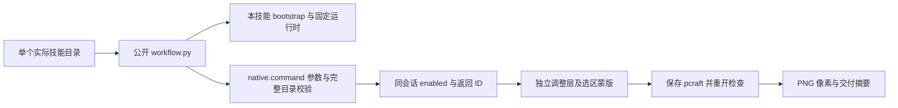
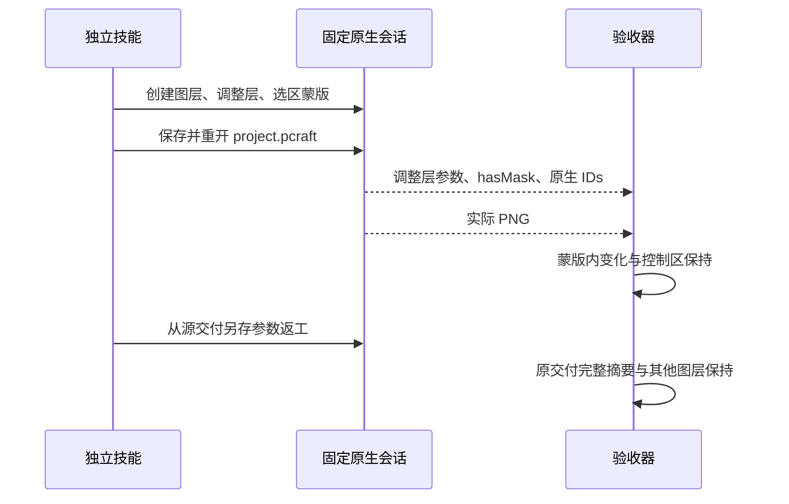

# PhotoCraft 可编辑局部调整与蒙版方案

## 问题与交付合同

完整反射目录已有748条命令，但目录和参数原文不能证明首次创作可完成。此次补充独立调整层＋矩形选区蒙版＋源工程返工的成对计划，覆盖十二个可单独安装技能。产物为 project.pcraft、native.json、design.png、operations.json、manifest.json 和 exchange-loss.json；PNG 展平损失明确记录，不能替代原生编辑工程。

## 调用架构

本次仅扩展知识、成对计划、命令参考与测试，不修改研究仓库或原生运行时。CodeGraph 指向原生 commands.new_adjustment、adjust_cmds.update_adjustment 和文档 Layer.mask。实际参数与持久化行为最终以公开固定原生运行结果验证。

## 参数与状态

128×64，Product 位于 [8,8,40,48]，Control 位于 [80,8,40,48]。新建 brightnessContrast 调整层，绑定真实 layer ID，select.rect 使用 x=8,y=8,width=20,height=48,antiAlias=false,feather=0，再 revealSelection 并 deselect。brightness=30,contrast=0,legacy=false。返工读取真实源 manifest 中 project.pcraft 摘要，重开后 layer.select，再 setAdjustment 设置 brightness=-30，并另存。

setAdjustment 的部分参数不能默认理解为保留旧值，因此示例同时传 brightness、contrast、legacy。错误层类型需要拒绝。原生 enabled 的选择状态不能用显式 layer ID 代替。

## 验收与恢复

测试以独立 .agents/skills 副本和空运行时调用公开入口，检查真实下载、保存重开、原生调整值30→-30、蒙版持久化、目标像素、x≥32完整控制区像素及非目标图层信息（选择标记属于会话状态）、原交付保护、错误层类型拒绝、技能摘要不变与无pyc。unknown 保留仍采用既有工作流机制，不能自动重放编辑。

## 规格与证据边界

沿用插件 OpenSpec establish-v1-plugin 的 PC-CM-001，新增8.13源候选、8.14固定安装、8.15 Art分发验收。完整8.3和PC-DM-002全部场景门禁保持开放。此证据不支持全部748条命令、PSD保真、GUI、模型分派、其他平台或完整V1。

测试入口：tests/test_adjustment_mask_first_use.py；原生测试需显式 CRAFT_PHOTO_ADJUSTMENT_FIRST_USE=1，可通过 CRAFT_PHOTO_ADJUSTMENT_SKILL 指定待测副本，CRAFT_PHOTO_ADJUSTMENT_REPORT 输出证据。生成器 build_command_coverage.py 将实际使用命令与 paired recipes 关联，并维持完整逐命令状态 NOT_RUN。
