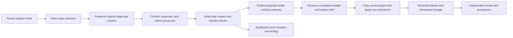
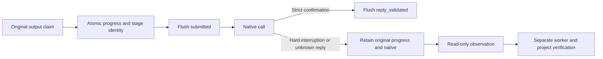

# Checkpoint sources and explicit recovery revisions

This is a PC-TX-002 candidate. Fixed publication and the full crash matrix remain unverified; tasks3.6/10.9 stay open. The active runtime is still0.2.0-craft.1.

Failed stages retain their original paths and now include a hash-covered `recovery-context.json`: original plan, execution identity, validated bindings, registered assets and capability snapshot. Legacy stages without this context remain eligible for read-only reopening but cannot acquire revision rights through a fabricated delivery manifest.

The plugin entry is `node src/cli.ts recover --state-dir <absolute-state> --task <original-id> --proposal <absolute-proposal>`. A proposal contains `baseProjectSha256`, `checkpointRecordSha256`, `authorizationRef`, `reason` and `operations`. Current recovery supports existing text content/style and layer names, bound to explicit layer IDs. Object authority and original protected regions are inherited; non-target objects must remain unchanged. Creating another layer is not a recovery strategy for an unknown edit.

Recovery reconciles again and requires a matching original supervisor exit receipt, absent owned process groups, original plan identity and unchanged checkpoint files. PID disappearance or lock expiry alone is insufficient. Original attempted state, epoch and unknown outcome remain preserved. Repeating the same explicit proposal returns the same child; cumulative revision counts and deadlines never reset. Cancellation, exhausted budgets, scope violations, no improvement, source drift and checkpoint changes refuse new edits.

The standalone workflow accepts `--checkpoint <failed-output> --write-root <authorized-root>` instead of `--source`. Its new plan requires `expectedCheckpointSha256`, `expectedCheckpointPlanSha256` and `expectedProjectSha256`. It reopens read-only before copying the saved project and registered assets, then executes only the new operations. Delivery includes `checkpoint-origin.json`. This lower-level entry does not replace the plugin's durable budget or process-exit gates.

A checkpoint is not a technically accepted parent artifact. New craft-artifact/v1 sourceRefs identify `photocraft-checkpoint:<original-id>` and the saved project digest; evidenceRefs include the checkpoint origin. No successful parent manifest/artifact is fabricated. Creative and acceptance states remain NOT_RUN after technical success and require independent review and acceptance.

Candidate tests: `test_checkpoint_source.py` and `checkpoint-revision.test.ts`, including actual native save-reply loss, retained original files, explicit title repair, process proof, authority, budget, proposal idempotency and lineage. Native plugin tests require PHOTOCRAFT_NATIVE_TEST=1, PHOTOCRAFT_SKILL_ROOT, PHOTOCRAFT_SOURCE_ROOT (an immutable source snapshot containing injection fixtures) and PHOTOCRAFT_PYTHON. Fixed installation, full restart coverage, host model, GUI and full V1 require separate evidence.

## Successful delivery producer identity

Supervised success writes all five task identity fields into hash-covered task-binding.json and the manifest. Read-only validation checks structure and consistency; Harness compares the persisted original identity. Legacy unbound deliveries remain readable without gaining acceptance as a current supervised task.

## Durable progress across hard interruption

An independent atomic progress file binds the original output claim, plan, task, runtime and stage identity. Each native call follows a flushed submitted record; strict confirmation precedes a flushed reply_validated record. The plan, bindings, assets and known capability snapshot survive with it. Read-only inspection installs nothing, starts no session and changes neither project nor original claim. Observed progress does not prove worker termination, native integrity or revision permission. Missing failure.json is never fabricated.

