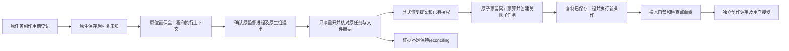

# 检查点来源与显式恢复修订

本轮为PC-TX-002候选实现，固定发布与完整崩溃矩阵尚未验收，任务3.6／10.9保持开放。活动运行时仍为0.2.0-craft.1。

失败暂存保留原位置的工程、素材、回执，并新增受failure文件清单摘要保护的`recovery-context.json`：原计划、执行身份、已验证绑定、登记资产及能力快照。缺少上下文的旧暂存仍可只读重开，但不能补造manifest获得恢复写入权。

插件入口为`node src/cli.ts recover --state-dir <绝对状态目录> --task <原任务ID> --proposal <绝对提案路径>`。提案包含`baseProjectSha256`、`checkpointRecordSha256`、`authorizationRef`、`reason`和`operations`。当前恢复操作支持已有文字内容／样式及图层名称的局部修改；每项绑定明确图层ID，继承对象授权与原保护区域，非目标对象必须保持。新图层创建不是恢复旧未知操作的手段。

恢复前重新reconcile，要求原退出回执与任务、epoch、工作令牌、来源摘要匹配，原进程组已消失，原计划与保存工程一致。不能仅用PID消失或过期锁证明已停止。旧任务attempted和epoch不重置，保留unknown结果；同一显式提案返回同一子任务，修订计数与截止时间不重置。取消、耗尽预算、越权、无变化、源漂移或检查点变化均拒绝新增编辑。

独立工作流接受`--checkpoint <原失败输出> --write-root <已有授权根>`，与正常`--source`互斥。新计划还需三个摘要：`expectedCheckpointSha256`、`expectedCheckpointPlanSha256`、`expectedProjectSha256`。执行前只读重开，复制已保存工程及登记资产，不重放原operations；交付包含`checkpoint-origin.json`。此低层入口不替代插件持久预算和原进程退出门禁。

检查点不是technical PASS的父产物。新产物使用现有craft-artifact/v1的sourceRefs引用`photocraft-checkpoint:<原任务ID>`及工程摘要，并把来源证明列入evidenceRefs，不伪造父交付manifest或父artifact。新产物技术通过后creative和acceptance仍为NOT_RUN，须独立评审与接受。

验证：候选源测试`tests/test_checkpoint_source.py`涵盖保存回复丢失后修改现有标题、原文件保全、计划／记录／工程／资产身份拒绝；插件`tests/checkpoint-revision.test.ts`涵盖原退出证明、授权／预算／提案幂等与新产物血缘。开启插件原生测试时需`PHOTOCRAFT_NATIVE_TEST=1`、`PHOTOCRAFT_SKILL_ROOT`、`PHOTOCRAFT_SOURCE_ROOT`（包含不可变测试代理fixture的源仓快照）及`PHOTOCRAFT_PYTHON`。这些候选测试不替代公开安装、完整重启矩阵、宿主模型、GUI或完整V1验收。
