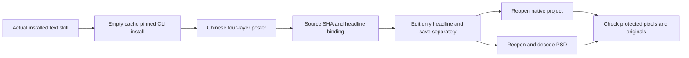

# PhotoCraft Chinese Text First-Use Architecture

## 1. Specification and identity

PC-DM-003 and task 4.19 govern bounded frozen-release acceptance, not complete typography acceptance. Plugin dev.6, skill source dev.5 and native CLI 0.2.0 are unchanged. No new release tag is created; evidence binds plugin, source and text-skill hashes.

## 2. Installation and execution

The actual host-installed photocraft-cli-text skill is copied alone into project `.agents/skills`. Its own poster plan, installer and workflow run from the actual SKILL.md directory. The domain cache starts empty and uses public pinned downloads. Production scripts run with existing default Python 3.14.3; Pillow is test-only.

## 3. Revision and delivery

The example explicitly uses existing Songti SC. Editing 新品上市 to 品牌焕新 preserves headline layer ID, font and size. Product and caption native properties, protected pixels and all original delivery files remain unchanged. PSD retains editable Type content and Chinese text; decoding through the same skill's public convert entry matches native PNG RGBA pixels exactly. Unknown layers and missing fonts fail without publishing a successful output directory.

## 4. Evidence

Actual installed single-skill public cold-start acceptance: 1 test passed in 5.927 seconds. Default regression: 37 tests, 24 passed and 13 gated native tests skipped in 7.308 seconds. All 58 installed hashes remain bound to the release lock after execution. The current assistant inspected v2 PNG and observed readable four-character text; human acceptance remains NOT_RUN. Evidence: docs/evidence/chinese-text-first-use.json.

## 5. Boundaries

Only the explicit font and sample glyphs are proven. All fonts, complex CJK, overflow, external editor GUI and human creative acceptance are not inferred. Product pixels are a synthetic fixture, not real photography acceptance. Actual npx installation and new model dispatch remain unexecuted.

An additional full cold test confirms exact headline text/font/size equality between reopened PSD and native inspection (1 test passed, 5.546 seconds). All 58 installed hashes were verified again after this run.
