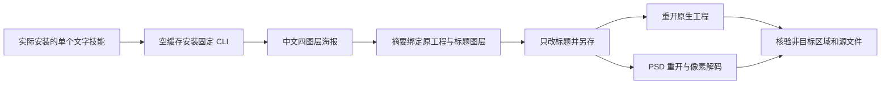

# PhotoCraft 中文文字首次使用架构

## 1. 规范与身份

沿用 PC-DM-003，任务 4.19 对固定发布版补充有界验收，不扩展为完整排版验收。插件 dev.6、技能源 dev.5、原生 CLI 0.2.0。技能字节未改变，因此本次不创建新发行标签。证据记录实际插件、技能源和文字技能摘要。

## 2. 首次安装与执行

实际宿主安装的 photocraft-cli-text 单独复制到项目 `.agents/skills`，仅使用自己携带的 poster-plan、安装器和工作流。以实际 SKILL.md 目录定位脚本，从空领域缓存执行公开固定制品下载。现有默认 Python 3.14.3 执行生产脚本；Pillow 仅用于测试断言。

## 3. 修订与交付

示例标题明确使用本机已有 Songti SC；从新品上市改为品牌焕新，保持标题图层 ID、字体和字号。产品与其他文字保持原生层属性，标题以外像素和旧交付全部不变。PSD 保留可编辑 Type 层和中文内容；用同一技能公开 convert 入口解码后与 PNG 的 RGBA 像素完全一致。未知图层和缺失字体请求失败，成功交付目录不发布。

## 4. 验证证据

固定宿主单技能全新在线验收 1 项通过，5.927 秒。默认回归 37 项，24 项通过、13 项原生门禁跳过，7.308 秒。执行后全部 58 个安装技能摘要仍匹配固定发行锁。当前助手查看 v2 PNG，中文四字可读；人工接受仍为 NOT_RUN。证据：docs/evidence/chinese-text-first-use.json。

## 5. 边界

只证明明确字体和样例四字；不推断所有字体、复杂 CJK、排版溢出、外部编辑器 GUI 或人类创作接受。产品是合成像素 fixture，不证明真实商品摄影质量。实际 npx 安装与新模型会话派发仍未运行。

增加 PSD 与原生标题文字、字体和字号完整相等断言后，完整冷启动测试再次通过（1 项，5.546 秒），执行后重新核验全部 58 个安装摘要。
