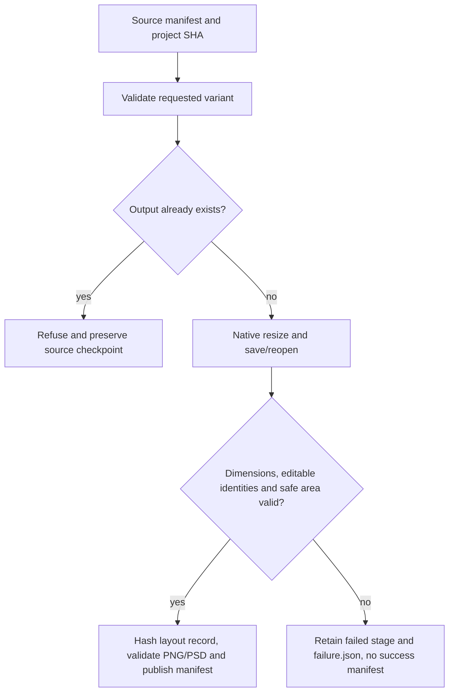

# PhotoCraft complete size-variant contract

PC-DM-004 is verified for the current fixed PhotoCraft plugin38/source34 macOS arm64 CLI matrix. The independently copied installed `photocraft-cli-resize` skill starts from an empty runtime and produces native, PNG and PSD outputs for padding360×440, crop300×380 and resample160×200 from the same320×400 source. This maintenance change updates tests and acceptance records; fixed skill and runtime bytes remain unchanged.

The source manifest and project SHA bind each revision. Native `image.canvasSize` offsets become explicit crop/padding records; `image.imageSize` becomes a resampling scale. The reopened project determines dimensions and background/product/text identities. The hashed `layout-variant.json` records operations, actual bounds and declared safe area. PNG dimensions and corresponding PSD layer kinds/text are checked separately. Source files remain byte-identical after success and rejection.

The public entry is `python3 -I -B "$SKILL_ROOT/scripts/workflow.py" PLAN --source SOURCE_DELIVERY --output NEW_VARIANT`. `SKILL_ROOT` is the actual host-loaded independent skill directory. The plan includes `expectedProjectSha256`, native geometry operations, export formats and `variant` with target dimensions, safe area and three role references. Existing source/output paths are never overwritten.

A prior test incorrectly required the diagnostic output directory to be absent after a native safe-area refusal. PC-TX-004 requires failed-stage retention. The updated test verifies no successful manifest or native delivery at the output root, an explicit failure reason, disabled replay, and exact hashes for the retained native stage. It does not remove diagnostics or weaken the size/safe-area requirement.

The original pre-variant workflow at db975e18dea5f08ec933405dfed4d8e1bcb36e39 silently accepted an invalid variant safe area. That historical red was reconstructed this turn; the current preflight rejects it. Seven focused tests cover geometry records, mismatched sizes, safe areas, changed/duplicate roles and invalid configuration. The retained native first-use test covers all four current PC-DM-004 scenarios, including source overwrite refusal and three real transformations. The source suite passes119 tests with31 opt-in skips; independent native acceptance passes1 test in5.329s.

[Fixed contract evidence](evidence/photocraft-complete-variant-contract-20261008.json) binds all13 installed Photo skill hashes after use, exact tracked source/tag identity, native files and test/log fingerprints. Ignored source cache files are reported separately and are not release evidence. Only tasks4.10/4.11/4.12 are closed. Other requirements, other platforms, generic Skills CLI installation, full command contexts, human creative acceptance and V1 remain open.
