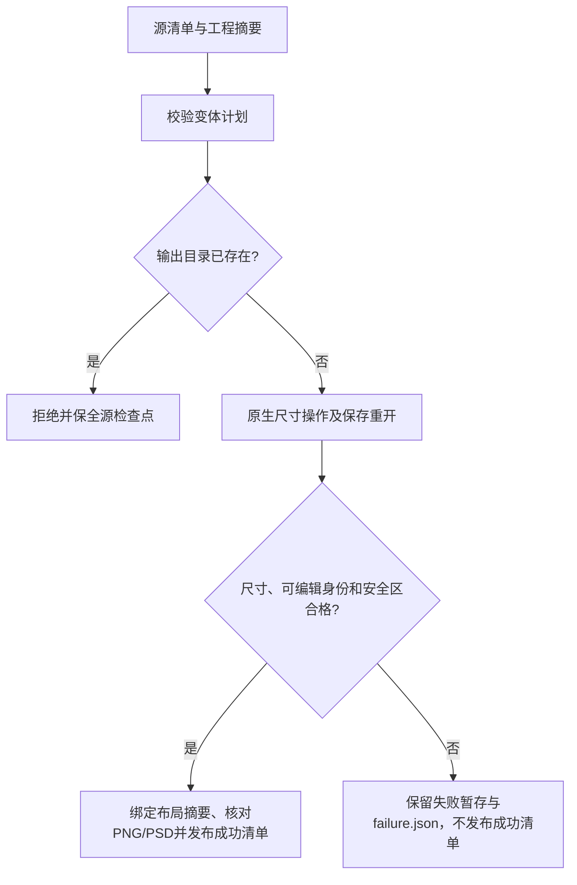

# PhotoCraft 海报封面尺寸变体完整合同

当前固定 PhotoCraft 插件38／源34 的 macOS arm64 CLI 矩阵已完成 PC-DM-004 验收。实际安装的 `photocraft-cli-resize` 被单独复制，从空运行时自动安装，在同一320×400源工程上产生360×440留白、300×380裁切和160×200重采样变体，交付原生工程、PNG及PSD。本次只维护测试和验收记录，固定技能及原生程序字节不变。

每次返工以源manifest和工程SHA绑定版本。原生 `image.canvasSize` 的实际offset形成裁切与留白记录，`image.imageSize` 形成缩放比例。重开的原生工程决定实际尺寸及背景／产品／文字身份；带摘要的 `layout-variant.json` 保存操作、实际边界和声明安全区。PNG尺寸与PSD中对应图层类型、文字分别核验。成功及拒绝后，源交付全部文件逐字节保持。

公开入口为 `python3 -I -B "$SKILL_ROOT/scripts/workflow.py" PLAN --source SOURCE_DELIVERY --output NEW_VARIANT`；`SKILL_ROOT` 使用宿主实际加载的独立技能目录。计划包含 `expectedProjectSha256`、原生尺寸操作、导出格式，以及声明目标尺寸、安全区和三种角色引用的 `variant`。已有源目录或输出目录不会被覆盖。

原测试曾要求原生安全区拒绝后诊断目录不存在，与 PC-TX-004 的失败工程保留要求冲突。修正后的测试要求输出根目录没有成功manifest及原生交付，具有明确失败原因、禁止自动重放，并逐项核对暂存工程文件摘要。保留诊断，不放宽尺寸或安全区要求。

原尺寸变体实现前的workflow提交 db975e18dea5f08ec933405dfed4d8e1bcb36e39 会静默接受非法安全区；本轮重建该历史失败，当前前置校验正确拒绝。7项目标测试覆盖几何记录、尺寸、安全区、身份变化／重复及非法配置；保留产物的原生首用测试覆盖当前PC-DM-004全部4场景，包括源覆盖拒绝与3种实际尺寸操作。源码回归119项通过、31项条件跳过；独立原生验收1项通过，5.329秒。

[固定合同证据](evidence/photocraft-complete-variant-contract-20261008.json)绑定执行后全部13个Photo安装技能摘要、源码受控文件与固定标签身份、原生文件及测试／日志指纹。源码已有忽略缓存单独报告，不当作发行证据。仅关闭4.10／4.11／4.12，其他要求、其他平台、通用Skills CLI、全量命令上下文、人工创作接受及完整首版继续开放。
