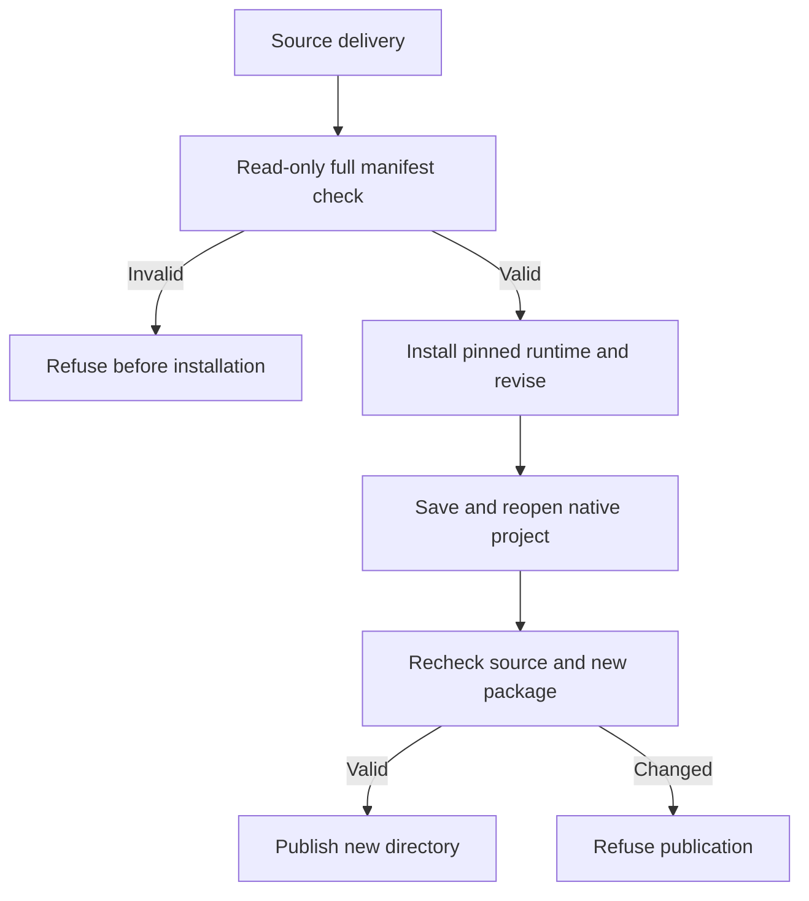

# Delivery integrity before revision

PhotoCraft revisions previously checked only the native project digest. A replaced preview could reach runtime installation. Each independent skill now includes delivery.py, which checks every manifest file, registered asset, native/inspection/export/loss-report identity and variant reference. Revisions check the complete source before installation, bind its manifest for the duration of the call, and check source and new package again before publication. Existing expectedProjectSha256 remains required; optional expectedManifestSha256 binds an independently recorded package version.

Read-only checks do not install dependencies or alter files. Relative paths allow intact moved packages; symlinks, traversal, duplicate JSON keys and mismatched files/references are refused. Without an external manifest digest this does not authenticate authorship or detect coordinated replacement of both files and manifest. Restore the original files or make a newly reviewed delivery rather than silently rewriting old hashes.

Source regression:149 total,118 passed,31 conditional skips. A single cold-installed export skill created a four-layer masked poster, moved it after deleting the original asset, revised its headline, preserved non-target layers/source files, and rejected a replaced preview before installation in5.165seconds. This is a source candidate; fixed plugin38 installation remains separate. Full lineage, PSD fidelity and creative acceptance remain open.

[Source evidence](evidence/photocraft-delivery-integrity-source-20261008.json).
