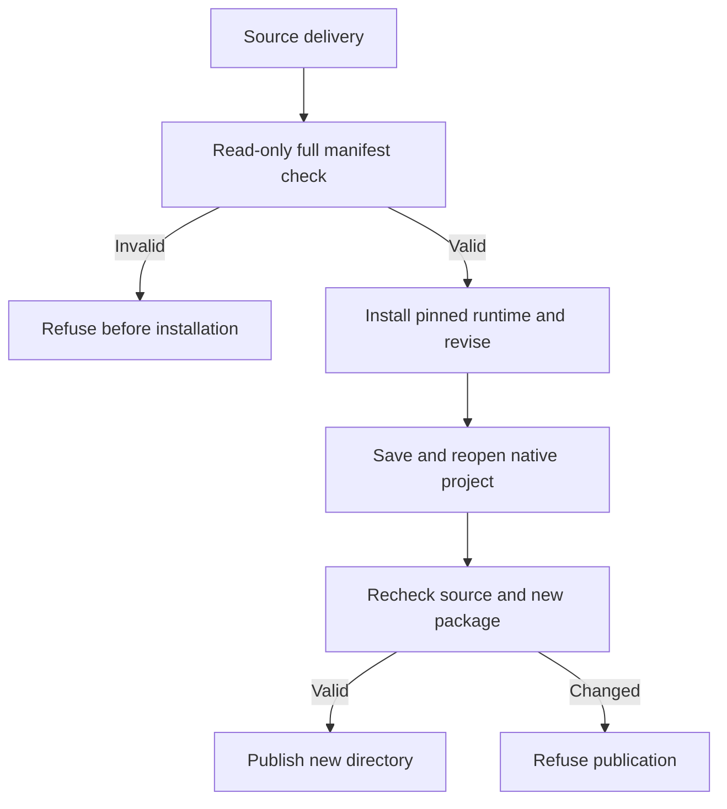

# 返工前的交付完整性

原PhotoCraft返工只核对原生工程摘要，替换同名预览后仍可进入运行时安装。现在每个独立技能自带delivery.py，核对清单全部文件、登记素材、原生／检查／导出／交换报告身份及变体检查引用。返工在安装前核对完整源包，在同次调用中固定源清单摘要，发布前再次检查源包与新包。既有expectedProjectSha256保持必需；可选expectedManifestSha256绑定独立记录的清单版本。

只读检查不安装依赖、不编辑文件；相对路径使未改动的移动包可继续使用。符号链接、路径逃逸、重复JSON键和文件／引用错配均拒绝。未提供外部清单摘要时，不能证明作者身份，也不能检测文件和清单一起被替换。恢复原文件或重新评审交付，不静默重写旧摘要。

源码回归149项，118通过31条件跳过；单导出技能冷安装创建四层蒙版海报，删除原素材后移动包、另存修改标题、保全非目标图层与源文件，并在安装前拒绝同名预览替换，5.165秒通过。这是源码候选，固定插件38安装另验。完整血缘、PSD保真与创作接受仍开放。

[Source evidence](evidence/photocraft-delivery-integrity-source-20261008.json).
