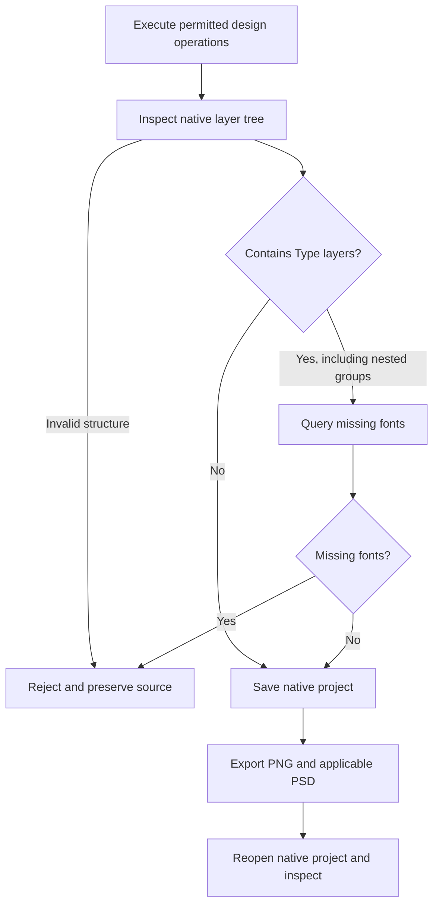

# PhotoCraft Font Preconditions Architecture

> Scope: PC-DM-003-NO-TEXT; source 0.1.0-dev.9 candidate; native CLI 0.2.0.
> Updated: 2026-10-06. Fixed installed-plugin acceptance remains pending.

## 1. Problem and decision

The native `type.resolveMissingFonts` command requires at least one Type layer. Calling it unconditionally prevents an image-only design from reaching native save and export. The workflow now inspects the native document before saving and recursively examines Group children. It queries missing fonts only when Type layers exist. Inspection errors and command errors propagate; missing fonts still reject delivery. No font substitution is introduced.

## 2. Boundaries and failure behavior

The independent source owns the workflow. The suite generator copies it into all 12 skills; plugins consume an immutable source tag through the vendor tool. Native runtime identity and installation behavior are unchanged. No CLI or Skill installation path is hardcoded.

`invalid_native_layer_inspection` rejects missing or malformed layer trees, including malformed group children even when another Type layer is already found. A Type layer requires the native font check to succeed; `missing_fonts` rejects publication. Existing staged-output handling preserves the source and removes unsuccessful staging.

## 3. Verification and delivery

The regression copies only the layers skill to an isolated `.agents/skills` directory, downloads the fixed native runtime from public distribution into an empty cache, and invokes the public workflow with a system-only PATH. It creates a synthetic image-only composition, checks reopened Pixel layers, compares independently decoded PSD and PNG RGB pixels, revises the layer name while retaining IDs, and rejects a real missing-font case. Inputs, source delivery and both skill trees retain their hashes.

[Candidate evidence](evidence/fontless-source-candidate-20261006.json) records the target RED failure, one cold native PASS, the existing text/mask/revision native PASS and 56 default tests (38 passed, 18 gated skips). Nested Group detection and malformed inspection rejection have unit coverage; this is not full group GUI or complete PSD fidelity acceptance.

## 4. Release and remaining work

Publish an immutable source tag, vendor that tag into the next PhotoCraft plugin, and repeat with an actually installed skill. Then update ArtCraft's Photo source bundle and verify the mixed Vector-to-Photo workflow using public downloads. Candidate tests do not close that fixed-release task. Full creative acceptance, model dispatch, GUI and other platforms remain open.

## 5. Fixed Photo plugin evidence

Plugin dev.10 / source dev.9 now passes actual isolated Codex 0.153.4 discovery and copied-alone layers-skill public cold native repetition (5.601s). All 58 installed skill digests are preserved. This supersedes the pending Photo-only installed check above; upgraded Art mixed acceptance is recorded separately. [Proof](evidence/codex-photo10-fontless-first-use-20261006.json).
