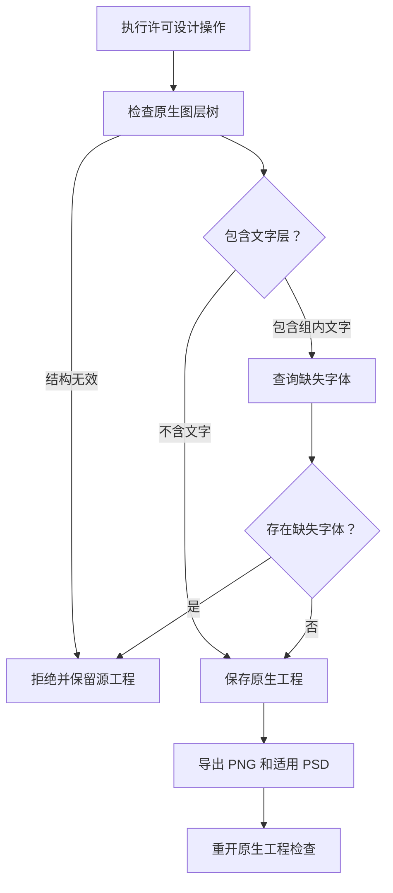

# PhotoCraft 字体前置条件架构

> 范围：PC-DM-003-NO-TEXT；技能源 0.1.0-dev.9 候选；原生 CLI 0.2.0。
> 更新：2026-10-06。固定插件真实安装验收仍待完成。

## 1. 问题与决策

原生 `type.resolveMissingFonts` 命令要求文档至少含一个 Type 图层。无条件调用会让纯图片设计在保存和导出之前失败。工作流现于保存前检查原生文档，递归检查 Group 的 children；仅含 Type 图层时查询缺失字体。检查结构错误和命令错误继续向上传播，缺失字体仍拒绝交付，不自动替换字体。

## 2. 边界与失败处理

独立技能源维护工作流，套件同步器复制到全部 12 个技能；插件通过 vendor 工具消费不可变来源标签。原生运行时身份和安装行为不变，不硬编码 CLI 或技能安装路径。

图层树缺失、结构异常及组 children 异常返回 `invalid_native_layer_inspection`；即使前面已经发现文字层也不能忽略后续异常。含文字时必须成功检查字体，缺失字体返回 `missing_fonts` 并拒绝发布。现有暂存机制保留源交付，清理失败输出。

## 3. 验证与交付

回归只复制图层技能到隔离的 `.agents/skills`，在空缓存通过公开发行下载固定原生运行时，用系统 PATH 调用公开工作流。测试创建合成纯图片工程，检查重开的 Pixel 图层，独立解码 PSD 并与 PNG 全部 RGB 像素比对，另存重命名图层且保留 ID，再验证真正缺失字体时拒绝。素材、源交付、原始及复制的技能目录摘要不变。

[候选证据](evidence/fontless-source-candidate-20261006.json) 记录目标 RED、1 项冷启动原生通过、原有文字／蒙版／修订原生通过，以及默认 56 项测试（38 通过、18 项开关跳过）。组内文字检测和异常结构拒绝有单元覆盖，不代表完整组 GUI 或完整 PSD 保真验收。

## 4. 发布与剩余工作

发布不可变技能源标签，用 vendor 工具同步到下一版 PhotoCraft 插件，再用真实安装技能复验。随后更新 ArtCraft 的 Photo 技能源包，通过公开下载验证 Vector 到 Photo 混合流程。候选测试不能关闭固定发布任务。完整创作验收、模型派发、GUI 和其他平台仍未完成。
