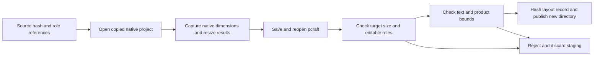

# PhotoCraft layout variant architecture

This change adds source-bound geometry evidence to the independent workflow, without changing the native runtime version. A variant declares target dimensions, a final-canvas safe rectangle and distinct source background/product/text layer identities.

Canvas steps record the native returned offset; four-edge crop/padding are calculated in that step's coordinate frame. Resampling steps record horizontal/vertical scale. Multiple steps retain their order rather than claiming a single lossless transform. Safety checks use reopened native layer bounds; PNG dimensions and PSD editable role names/types are verified in the native integration test. The record is bound by manifest SHA-256.

Validation: six unit tests; default suite 36 passed and 16 optional native tests skipped; one opt-in copied-skill cold-install test passed, covering crop, padding, resampling, native/PSD reopening, PNG dimensions, unsafe-area rejection, size-mismatch rejection and preservation of all original delivery files. This bounded fixture is not aesthetic, brand, print or complete host acceptance. Formal plugin task 4.22 remains pending fixed publication and installed-plugin repetition.
