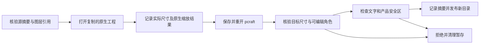

# PhotoCraft 尺寸变体架构

本增量为独立工作流加入源工程绑定的几何证据，不修改原生运行时版本。变体声明目标尺寸、最终画布安全矩形，以及互不相同的背景、产品、文字源图层身份。

画布调整记录原生返回的位移，并按每一步坐标计算四边裁切和留白；图像重采样记录横纵比例。多次调整按顺序记录，不合并为虚假的无损变换。安全区门禁读取重开的原生图层边界；集成测试同时检查 PNG 实际尺寸，以及 PSD 的角色名称和可编辑类型。manifest 绑定变体记录的 SHA-256。

验证：6 项单元测试通过；默认套件 36 项通过、16 项可选原生测试跳过；独立复制尺寸技能的冷安装测试 1 项通过，覆盖裁切、留白、重采样、原生与 PSD 重开、PNG 尺寸、越界拒绝、尺寸不符拒绝和源交付全部文件保全。这些功能样例不代表审美、品牌、印刷或完整宿主验收。固定插件 dev.9 与技能源 dev.8 的安装后冷启动复验通过（1 项，6.046 秒），已有蒙版/改字/PSD 原生回归通过（1 项，0.505 秒）；58 个安装技能的全部文件摘要保持不变。任务 4.22 仅按此技术范围验收。
