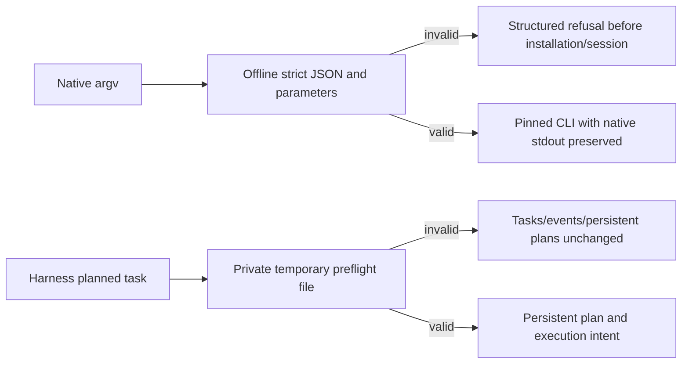

# Native argv preflight and Harness candidate supplement

PC-TX-005 and task9.6 remain authoritative. This unpublished candidate follows source dev.39/plugin dev.44; immutable tags and managed plugin snapshots are preserved.

Before installation, native run/batch/droplet/convert validate argv, strict JSON and registered command parameters. Refusals expose code, phase, outcome, retryable, recoveryAction, category and fieldPath. Thirteen invalid cases have zero installer/session/output effects, and all13 independent source skills refuse duplicate keys. The pinned maintained0.2.0-craft.1 accepts batch object arrays/actions wrappers; droplets separately accept tuples and bare IDs. Newer research checkout extensions are not current runtime features. Actual native creation, alternate-save revision, batch, droplet and32x32PNG conversion pass while preserving native JSON-line, text and empty stdout formats.

Runner preflight no longer writes persistent plans or failure events; its private temporary input is cleaned on success and error. Actual CLI audit still shows create initializes a ledger for a semantically invalid plan and run does not propagate complete structured preflight fields. Revision budget reservation, strict subprocess replies, MCP/serve streaming and native multi-step reply stopping need further work. These bounded static/native checks cannot close9.6.

Candidate, published fixed-installation evidence and complete command acceptance remain separate. Complete candidate regression passed13 checks:234 source tests,29 plugin TypeScript tests and48 plugin Python tests, zero skips and unchanged source fingerprints. New fixed release acceptance remains unexecuted. Task9.6 stays unchecked and28 plan tasks remain open.
