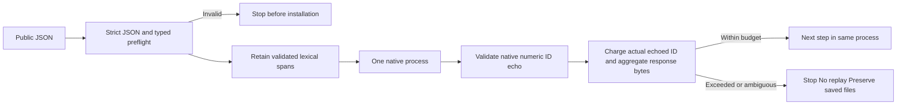

# Numeric wire fidelity and MCP lifecycle

This increment continues PC-TX-005. Strictly validated serve JSON retains its original wire bytes; decomposed batch children retain the original ID and step-parameter tokens. A valid 480KB ID containing120,000 `1e6` values previously expanded past the native1MiB request budget. The original numeric forms now reach the fixed runtime unchanged. This does not bypass the outer request limit or replay failed edits.

Serve IDs follow pinned serde_json number semantics: negative zero is a float, i64/u64 integers remain integral and out-of-range integers fall back to finite f64. Original request values remain in receipts; correlation compares the native echo. The outer success frame reserves the actual encoded echo ID rather than a fixed1MiB allowance. Stdio and TCP emit compact UTF-8 so whitespace or ASCII escaping cannot consume uncharged success-frame bytes. No frame limit is invented for MCP stdio.

The pinned rmcp3.5.0 source distinguishes pre-initialization ping, explicit initialize and the metadata-only first non-ping request. The latter requires typed protocolVersion and clientCapabilities metadata. The wrapper checks these before installation, preserves ping-before-initialize and both native session modes, and does not add an initialized-notification wait or impose metadata on later requests that the pinned service accepts. Known tools/list cursor, cancellation and progress fields are checked; metadata maps and ignored extension fields retain native compatibility. MCP request and progress IDs use signed64-bit integer or string types, including refusal of numeric negative zero.

Tests cover247 invalid lifecycle requests across13 independent skills. Actual stdio numeric/compound IDs and TCP clients save/reopen/inspect through one healthy native process per session; native MCP tests retain legacy and metadata modes after pre-init ping. GUI is NOT_RUN.

Full task9.6 and V1 remain open. The plugin separately validates Unicode in Harness JSON, canonical in-memory values and subprocess results. Other public input/lifecycle and reply matrices, including byte-decoding and cross-language numeric precision, still require a complete acceptance audit. No existing task is closed by these focused cases.
