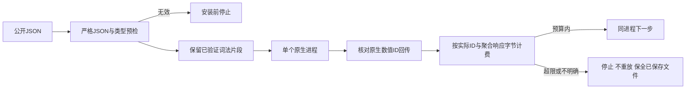

# 数值线缆保真与MCP生命周期

本增量继续PC-TX-005。serve严格校验后保留原始JSON线缆字节；批量拆分保留原始ID与每步参数的数值文本。包含120,000个`1e6`的约480KB合法ID原先会膨胀超过原生1MiB请求预算，现在按原文本转发。不绕过外层请求限制，不重放失败编辑。

serve ID遵循固定serde_json数值语义：负零为浮点值，i64/u64范围整数保持整数，越界整数回退到有限f64。回执保留原请求值，关联核验使用原生回传语义。成功包络按实际编码后的ID预留空间，不再固定假设ID仅占1MiB；stdio和TCP统一紧凑UTF-8，避免未计费的空白或ASCII转义扩大响应。不给MCP stdio新增帧限制。

固定rmcp3.5.0源码区分初始化前ping、显式initialize与逐请求元数据模式的首个非ping请求，后者要求类型有效的protocolVersion和clientCapabilities元数据。包装层在安装前核验，保留ping先于initialize以及两种会话模式，不强加initialized通知等待，也不拒绝固定服务实际允许的后续无元数据请求。tools/list游标、取消和进度通知的已知字段均校验，开放元数据及忽略扩展字段保留原生兼容。MCP请求与进度标识只接受有符号64位整数或字符串，数字负零拒绝。

13个独立技能覆盖247个无效生命周期输入。真实stdio数值／复合ID及TCP客户端在同一健康原生进程连续保存／重开／检查，原生MCP验证初始化前ping后的旧握手与元数据模式。GUI未运行。

完整9.6和V1仍开放；插件另行校验Harness JSON、内存规范化值及子进程回复的Unicode。其余公开输入／生命周期和回执矩阵，包括字节解码与跨语言数值精度，仍须完整验收审计。本增量不关闭已有任务。
