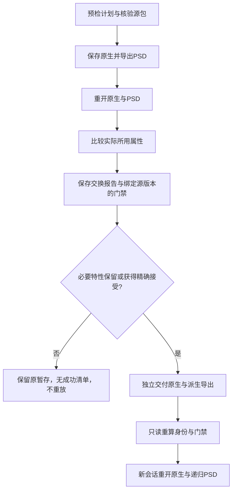

# PhotoCraft PSD 必要特性门禁

源候选 dev.36 实现现有 PhotoCraft 插件 OpenSpec 的 PC-DM-005-FEATURE 与 PC-AR-002-N。公开工作流阻止已观察的 PSD 丢失／降级，以及未知或未观察到的必要特性。原生工程保持事实源；已发行固定安装另行验收，不宣称外部编辑器、完整保真或创作接受。

`psdPolicy.requiredFeatures` 接受类别、精确递归位置或 `*`。`acceptedLosses` 记录精确特性、实际状态／观察摘要和原因；`acceptedForSourceSha256` 必须匹配已核验的源版本。新建时不能虚构源版本接受，应先形成成功原生源包，检查保留的拒绝记录，再基于该版本制作明确接受损失的独立导出修订。Agent 不得制造用户接受；已覆盖同一源和损失的授权继续有效。

`psd-acceptance.json` 绑定原生、PSD、两份重开检查和计划摘要，交换报告及 manifest 再绑定门禁。接受状态保持 `ACCEPTED_LOSS`，原始损失状态与 `completeFidelity=false` 不变。历史无新策略／门禁的旧包保留原只读完整性合同，不获得新的 PSD 保真或接受证据。

单元测试覆盖丢失／未知拒绝、过期状态或观察、错误源、多余接受、缺失门禁和语义重开。原生测试将导出技能单独复制，从空运行时启动，核对文字／蒙版／调整／混合属性与 PSD 合成 RGB 像素、改字、真实智能对象结构损失及效果未知的拒绝，重开保留暂存，再验证明确接受的损失。即使包内摘要全部自洽，串入其他 PSD 也会在新原生会话中拒绝。PSD 可重分配 ID，核对递归位置、完整持久图层属性和画幅；原生工程身份仍严格保留。

使用说明见独立技能自带的[交换政策](../skills/photocraft-use/references/exchange-loss.md)。源码测试设置 `CRAFT_PHOTO_PSD_FIRST_USE=1`；`CRAFT_INSTALLED_PHOTO_EXPORT_SKILL` 可指定实际安装技能，`CRAFT_PHOTO_PSD_POLICY_OUTPUT`／`CRAFT_PHOTO_PSD_POLICY_REPORT` 可保留新的自有测试目录和回执。用户媒体、下载运行时及原始测试工程不提交 Git。
