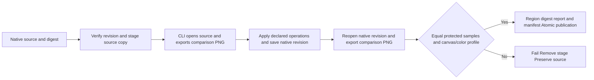

# PhotoCraft Protected Region Architecture

Status: immutable release, single-skill native integration and installed-plugin proof passed. Specification authority: PC-DM-002-GUARD; task 4.20 is verified. The native CLI stays at 0.2.0; this change adds a guard to the independent skill workflow.

Source revision plans may declare protectedRegions as named rectangles: id / rect=[x,y,width,height], using integer pixels from the source canvas top-left corner. A source project is required. Without declared regions, the workflow does not infer or promise protected areas.

The standard-library pixel_guard.py validates PNG data, CRC, bounded decompression and all five scanline filters, normalizes RGB/RGBA samples and compares named rectangles. Reports include sample SHA256 and changedPixels. Both comparisons are rendered by the real CLI; a mutable historical preview is not used as a source substitute.

The guard runs before publishing the destination directory. A valid title revision preserves protected product/background pixels; declaring the changed title region as protected refuses delivery. sourceProjectSha256 binds the source project. Both comparison PNGs and pixel-protection.json enter the delivery file digest table. This check does not replace editable-layer, visual, copy or human acceptance.

Scope: noninterlaced 8-bit RGB/RGBA PNG, maximum 64 MiB file and RGBA sample data, up to 128 rectangles. Unsupported encoding, color-key transparency, animated PNG, corrupt compression, invalid CRC, changed canvas/color-profile chunks and out-of-bounds rectangles are refused, never silently skipped.

Validation includes standard-library unit tests, public single-skill default online installation, real invalid/valid source revisions, preservation of every source file and no bytecode. The native RED records the old workflow incorrectly returning success for a changed protected region. Unit tests alone do not establish first-use acceptance; fixed-version and installed-host proof are recorded with their releases.

Installed PhotoCraft protection proof: 1 passed (11.073 seconds); installed ArtCraft pinned-dependency handoff: 1 passed (22.114 seconds), system Python 3.14.3. All 58 skills discovered, zero loading errors and every installed hash unchanged after execution. Proof: codex-release30-protected-native-20261006.json. The overall goal and creative acceptance remain incomplete.
