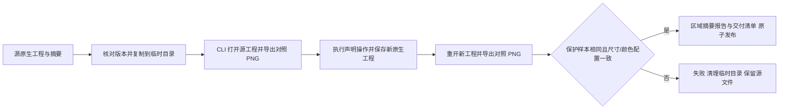

# PhotoCraft 保护区域架构

状态：固定发布、单技能原生联调和实际安装插件复验通过。规范事实源：PC-DM-002-GUARD；任务 4.20 已验证。原生 CLI 仍为 0.2.0，本次新增的是独立技能工作流的保护检查。

局部修订计划可声明 protectedRegions，格式为具名矩形 id / rect=[x,y,width,height]。矩形以源画布左上角为原点，整数像素单位。无声明时不推断或承诺保护区域；声明必须有源工程。

标准库 pixel_guard.py 校验 PNG 文件、CRC、压缩流长度及五种扫描行过滤器，转换为 RGBA 比对指定矩形，并记录区域样本 SHA256 与 changedPixels。源与新工程对照均由真实 CLI 渲染；不使用可被替换的旧预览冒充源工程。

保真门禁在发布目标目录前执行。合法标题修改可保留产品／背景保护区；把标题区域错误纳入保护区会拒绝交付。sourceProjectSha256 绑定源工程；两张对照 PNG 与 pixel-protection.json 都进入交付 files 摘要表。检查不能代替可编辑图层、视觉、文案或人工验收。

范围：8-bit 非交错 RGB/RGBA PNG；最大 64 MiB 文件及 RGBA 样本，最多 128 个矩形。不支持的编码、透明色键、动画 PNG、损坏压缩流、CRC 错误、画幅变化、颜色配置块变化或越界矩形均拒绝检查，不能静默跳过。

验收包含标准库单元测试、公开单技能默认在线安装、真实源工程非法／合法局部修改、全源文件保全及无字节码。源实现改变保护范围前的真实失败日志记录旧工作流错误返回成功；不能把只有单元测试通过当作首次使用证明。固定版本与最终宿主证据以对应发布记录为准。

实际安装 PhotoCraft 保护测试 1 项通过（11.073 秒），ArtCraft 固定依赖交接 1 项通过（22.114 秒），系统 Python 3.14.3；五插件 58 个技能发现通过、加载错误 0，执行后全部摘要不变。证据：codex-release30-protected-native-20261006.json。完整目标与创作接受仍未完成。

修图扩展（源码候选，尚未发布）：公开工作流接通 paint.stroke、paint.cloneStamp、paint.healingBrush，先显式选择像素图层。单技能在线原生测试验证绘制／恢复像素、原生与 PSD 重开、保护区域拒绝、全源文件保全。证据：evidence/retouch-workflow-first-use.json。固定发布和安装后的插件复验仍待完成，4.21 保持未勾选。直接原生 cli.py run 不经过此 Python 保护门禁。

固定发布及安装后修图复验现已通过；参见 evidence/codex-release31-retouch-native-20261006.json。仅完成有界任务 4.21，不提升完整领域／创作验收状态。
