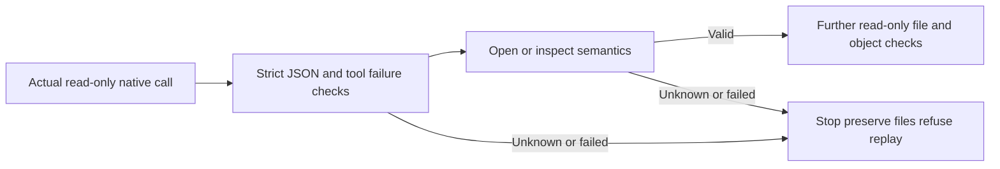

# PhotoCraft read-only native reply contract

This implements existing plugin PC-TX-005/PC-TX-002. Independent source dev.41 keeps the same maintained runtime and strengthens read-only verification only. Existing public dev.40 and managed plugin snapshots are unchanged until immutable-source vending.

Delivery and retained-stage reopening call validate_tool_reply after parse_reply. doc_open refuses scalar/empty replies, boolean/negative indices and conflicting document indices, while preserving valid headless indices and desktop path/warnings. doc_inspect requires positive integer dimensions and object layer lists. Invalid opening replies stop before inspection and never establish successful reopening.

CLI retains result=FAIL/error and adds code, phase=verification, outcome, retryable=false and recoveryAction. Known tool failures remain failed; malformed or semantically unproven replies remain unknown. Neither proves the original edit was unexecuted. Recovery does not infer meaning from localized text. Successful checkpoint verification remains partial evidence with technical/creative NOT_RUN.

Five contract tests reproduce and refuse earlier false successes. Actual tests create a complete project and a saved failed JPEG-transparency stage, then inject seven reply faults into each verifier after real read-only native replies, fourteen cases total. Invalid open replies allow only the open request; invalid inspection replies allow only open/inspect. Original file digests remain unchanged and both healthy verification paths pass. Synthetic cases do not replace native proof; ordinary text/image tools are outside these two read-only JSON contracts.

Full regression and immutable publication/fixed installation evidence are tracked in the plugin OpenSpec records. Raw per-command stopping, streaming editing contracts and the full entry matrix remain open; this change does not close9.6 or full V1.
