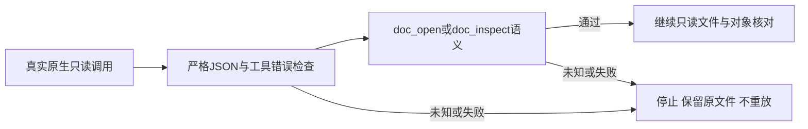

# PhotoCraft 只读原生回复合同

本变更落实插件既有PC-TX-005／PC-TX-002。独立技能源dev.41继续使用原固定维护版运行时，仅加强只读验证器；不改变已发布dev.40或插件管理快照。

交付重开与失败暂存重开均在parse_reply之后执行validate_tool_reply。doc_open拒绝标量、空对象、布尔／负索引及相互矛盾的索引；合法headless索引和桌面路径／警告格式保留。doc_inspect必须包含正整数宽高及对象图层列表。错误打开回复阻止后续检查；语义不明不记录成功。

CLI保留result=FAIL／error字段，并追加code、phase=verification、outcome、retryable=false和recoveryAction。明确工具失败为failed，畸形／语义不明为unknown；均不能证明原编辑未执行。错误恢复不依赖本地化文本。检查点成功仍为部分工程重开证明，technical和creative均NOT_RUN。

五项合同测试复现并拒绝原来的虚假成功。真实测试先创建完整工程和保存后的JPEG透明度拒绝暂存，然后分别对两个只读验证器的真实返回值注入七类故障，共14例；原生调用已成功后才替换回复。错误doc_open仅调用一次，错误doc_inspect只调用打开和检查；所有原文件摘要保持不变，两条健康路径通过。合成夹具不代替真实原生验收；普通文字／图片工具不进入这两种只读JSON合同。

完整回归与固定发布／安装证据在插件OpenSpec对应记录中维护。原生raw逐命令停止、MCP流式编辑合同及完整入口矩阵仍开放；不以本变更关闭9.6或完整V1。
