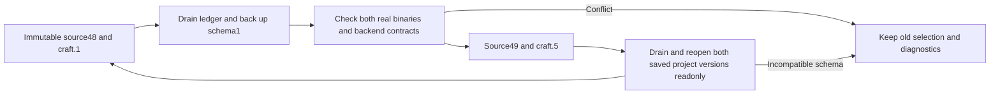

# Maintained native version transition

Source dev.49 pins CLI0.2.0-craft.5; source dev.48/craft.1 remains immutable. This source change does not upgrade existing installations or activate the internal raw/streaming supervisor. The plugin's explicit ledger lifecycle controls draining, retained resources, state backup and rollback. Its authoritative contract is PC-RT-002 in `full-aigc-plugins/photocraft-plugin` OpenSpec.

Both versions are maintained builds of upstream f114f621799a96dc9f28ffb8faa01da680b64947. The craft.5 archive contains the supervised-droplet patch, upstream licenses and PROVENANCE.json; the independent build receipt binds patch, compiler, Cargo.lock, archive and binary. It is not an unchanged upstream distribution.

The new headless registry is captured from craft.5 and compared against all755 reflected contracts. Owned desktop0.2.0 retains its independent signature and engine identity; a CLI version change does not claim a new desktop engine. Both CLI/desktop pairings must pass actual bridge probes separately.

Actual candidate evidence covers craft.1 → craft.5 → craft.1, original file hashes, new-version project reopening by the old binary, restored execution and state-schema refusal. Candidate full-source regression and fixed public-plugin acceptance are tracked separately; no task closes merely because this document or a runtime release exists. Other platforms, mutable GUI ownership, complete command execution, host/model routing and creative acceptance remain unverified.
