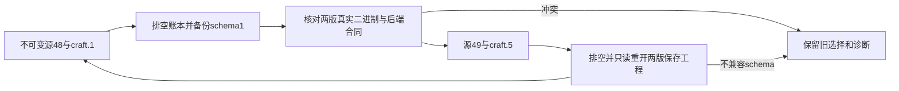

# 维护版原生版本切换

技能源dev.49锁定CLI0.2.0-craft.5；源dev.48／craft.1保持不可变。此源变更不会升级已有安装或启用内部raw／流式监督。插件的显式账本生命周期负责排空、资源保留、状态备份和回退；唯一行为合同仍为`full-aigc-plugins/photocraft-plugin` OpenSpec中的PC-RT-002。

两版均基于上游f114f621799a96dc9f28ffb8faa01da680b64947维护构建。craft.5制品包含supervised-droplet补丁、上游许可证和PROVENANCE.json；独立构建回执关联补丁、编译器、Cargo.lock、制品和二进制摘要，不是未经修改的上游发行。

新headless目录从craft.5实际捕获，并核对全部755项反射合同。自有桌面0.2.0保留独立签名与引擎身份；CLI版本变化不代表桌面引擎升级，两版CLI／桌面配对必须分别执行真实bridge探测。

候选证据已覆盖craft.1 → craft.5 → craft.1、原文件摘要、新版工程由旧版只读重开、恢复后执行及状态schema拒绝。候选完整源回归和公开插件固定安装另记，不因文档或运行时发行存在而关闭任务。其他平台、可变GUI写入权、完整逐命令执行、宿主模型路由与创作接受仍未验收。
