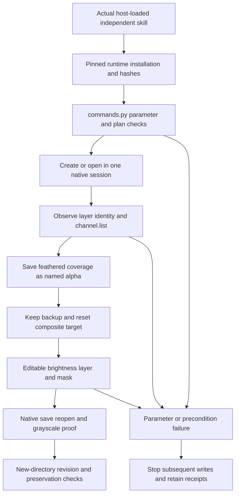

# PhotoCraft saved-selection and local-mask design

## Scope and delivery

This increment extends the existing PhotoCraft skill suite. Its authority is plugin OpenSpec `establish-v1-plugin`, scenario `PC-CM-001-SAVED-SELECTION`. The independent `photocraft-cli-selection` skill provides categorized selection/channel instructions, parameter discovery and self-contained create, reopen and revision plans. It owns 49 commands within the current 755-command PhotoCraft catalog. Catalog coverage does not establish acceptance of every context.

Deliver `project.pcraft`, the active-selection checkpoint `active-selection.pcraft`, composite `preview.png`, named-channel grayscale proof `selection-plane.png`, and step receipts. Revision writes a new directory while preserving the original project and backup channel. The pinned runtime remains `0.2.0-craft.1`; the native format is unchanged.

## State and execution architecture

Active selection is grayscale coverage. Layer identity, channel edit target and channel visibility are separate state. The pinned native `.pcraft` format **can persist active selection**; an earlier contrary test comment has been corrected. `select.saveSelection` also retains multiple named alpha regions, which survive deselection. Verify both active-checkpoint reopen and independent named-channel restoration.

Use returned channel indices and unique observed names. Re-query after moves or deletion. A new channel can change the edit target, so explicitly call `channel.target.composite` before adjustment/mask work. Duplicating a channel into a new document returns the document index used for grayscale export. Save the original first so that the proof document cannot replace the intended delivery.

## Creation and targeted revision

The fixture is a 128×80 RGB 8-bit document with gray Product, green Control and an editable brightness-30 layer. Feather rectangle `[16,24,24,32]` by 2 pixels, save `Product Local`, and duplicate `Protected region` as a backup. Restore primary coverage, reset composite target and create the adjustment mask. Save the active checkpoint; explicitly deselect for the final delivery.

Revision opens the source, inspects layers/channels, translates primary coverage 16 pixels right, replaces the primary channel and rebuilds the same adjustment mask. Preserve backup, layer content and adjustment settings. The fixture has a known top adjustment; real projects must observe IDs/layout rather than generalize an array index. Rectangle width/height arguments and transform corner coordinates have different semantics.

The 49-command classification covers geometric/color/subject selection, boundary edits, spatial conversion, panel selection, persistence, quick mask, channel management, shortcut targets and spot split/merge. Skill-local `references/saved-selection.md` supplies instructions and parameter entry points. Each skill carries its plans/resources without depending on sibling installation paths.

## Verification design

`tests/test_saved_selection_scene.py` verifies ownership classification, required channel operations and open-first reopen/revision plans. The opt-in native `tests/test_saved_selection_first_use.py` copies exactly one skill beneath a Chinese-and-space `.agents/skills` path and installs the public pinned runtime into an empty cache. It verifies active-checkpoint reopen, grayscale identity, fractional feather coverage, real composite pixels and translated coverage.

Read native manifests to compare non-target layers and backup channels, then compare referenced compressed tile bytes. Preserve source-project and skill-tree hashes and require identical layer-ID sets. No-document, missing-channel and invalid-operation failures stop later saving. The invalid-operation case first restores a valid active selection so it proves native parameter rejection rather than an unrelated disabled-context precondition.

[Current candidate evidence](evidence/photocraft-saved-selection-candidate-20261008.json) records source-candidate verification. At the source-candidate stage, immutable release, plugin vendor synchronization and actual host-installed-copy acceptance were `NOT_RUN`. Keep the bounded task open until those gates pass; full `PC-CM-001`, AI selection, other modes/depths, spot printing, PSD fidelity, GUI and creative quality remain separate.

Fixed plugin dev.35 / source dev.33 acceptance now passes 13 fresh independent public cold native scenes and CLI queries, 64 host identities/discovery and file preservation, and all four published ZIP asset digests. Only PC-CM-001-SAVED-SELECTION closes; full domain and V1 gates stay open.
