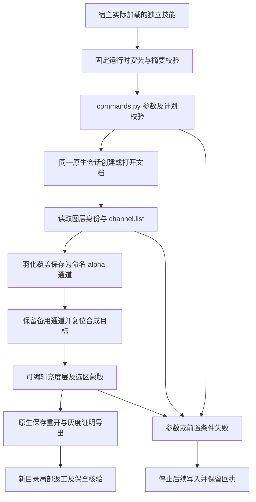

# PhotoCraft 持久选区与局部蒙版技术方案

## 范围与交付

本增量属于既有 PhotoCraft 技能体系，规格事实源为插件 OpenSpec `establish-v1-plugin` 的 `PC-CM-001-SAVED-SELECTION` 场景。独立 `photocraft-cli-selection` 技能提供选区／通道命令分类、参数查询与自包含创建、重开、返工计划。共有 49 个命令归属该技能；当前完整 PhotoCraft 目录为 755 个命令。分类和参数可查询不代表所有上下文都已验收。

输出包括 `project.pcraft`、保留活动选区的 `active-selection.pcraft`、复合画面 `preview.png`、命名通道灰度证明 `selection-plane.png` 和逐步执行回执。返工写入新目录，保留原工程及独立备用通道。运行时沿用固定 `0.2.0-craft.1`，不改变原生文件格式。

## 状态与执行架构

活动选区是灰度覆盖，图层身份、通道写入目标与通道可见性是不同状态。固定原生 `.pcraft` **可以保存活动选区**；之前测试中“不保存选区”的注释已纠正。`select.saveSelection` 可另存多个命名 alpha 覆盖，取消活动选区不会删除命名备份。应分别验收活动选区检查点重开和命名通道恢复。

通道索引使用真实返回值；名称需唯一。移动、删除通道后重新查询，不能复用旧索引。新通道可能改变编辑目标；应用亮度调整及蒙版前显式执行 `channel.target.composite`。将通道复制到新文档后，使用返回的文档索引导出灰度覆盖，原工程先保存，避免把证明文档误作交付工程。

## 创建与局部返工

实例为 128×80、RGB 8-bit 文档，包含灰色 Product、绿色 Control 和亮度 30 的可编辑调整层。矩形选区 `[16,24,24,32]` 羽化 2 像素，保存为 `Product Local`，另存 `Protected region` 备份。恢复主覆盖，复位合成目标，然后给调整层建立蒙版。保存活动选区检查点；最终交付显式取消活动选区。

返工先打开原工程、检查图层与通道，将主覆盖右移 16 像素，以 replace 更新主通道，并重建同一调整层蒙版。备份、图层内容及调整参数保持不变。实例使用已知最上方调整层；实际工程必须读取身份及布局后定位目标，不能泛化数组位置。`select.rect` 的宽高坐标与 `transformSelection.rect` 的两角坐标不可混用。

49 个命令的分类涵盖几何／颜色／主体选择、边界修改、空间转换、面板选择、持久存取、快速蒙版、通道管理、快捷目标及专色拆合。完整分类及参数入口见技能内部 `references/saved-selection.md`；每个技能自带计划和资源，不依赖兄弟技能安装位置。

## 验收设计

`tests/test_saved_selection_scene.py` 验证全部归属命令均有分类、创建计划包含关键通道操作且重开／返工从打开工程开始。`tests/test_saved_selection_first_use.py` 为显式启用的原生首用测试：只复制一个技能至含中文和空格的 `.agents/skills`，使用空缓存及公开固定运行时，检查活动选区重开、灰度覆盖一致性、羽化部分覆盖、实际局部像素及右移结果。

测试直接读取 `.pcraft` 的 manifest，比较非目标图层和备用通道，并逐块比较引用的压缩 tile 字节。检查原工程和技能树摘要，防止新增／删除图层被遗漏。无文档、未知通道和非法 operation 三类失败均停止后续保存；非法 operation 用例先成功恢复活动选区，确保触发原生参数拒绝，而非被缺失选区提前拦截。

[当前候选证据](evidence/photocraft-saved-selection-candidate-20261008.json)记录源码候选测试。源码候选阶段的固定发行、插件 vendor 同步及实际宿主安装副本复验当时为 `NOT_RUN`，后续固定验收单独记录。未完成前不勾选有界任务，不关闭完整 `PC-CM-001`、AI 选择、多模式／位深、专色印刷、PSD 保真、GUI 或创作质量验收。

固定插件 dev.35／技能源 dev.33 现已通过 13 项独立公开空缓存原生场景及 CLI 查询、64 项宿主身份／发现与文件保全，以及四个公开 ZIP 资产摘要核对。仅关闭 PC-CM-001-SAVED-SELECTION，完整领域及首版仍开放。
