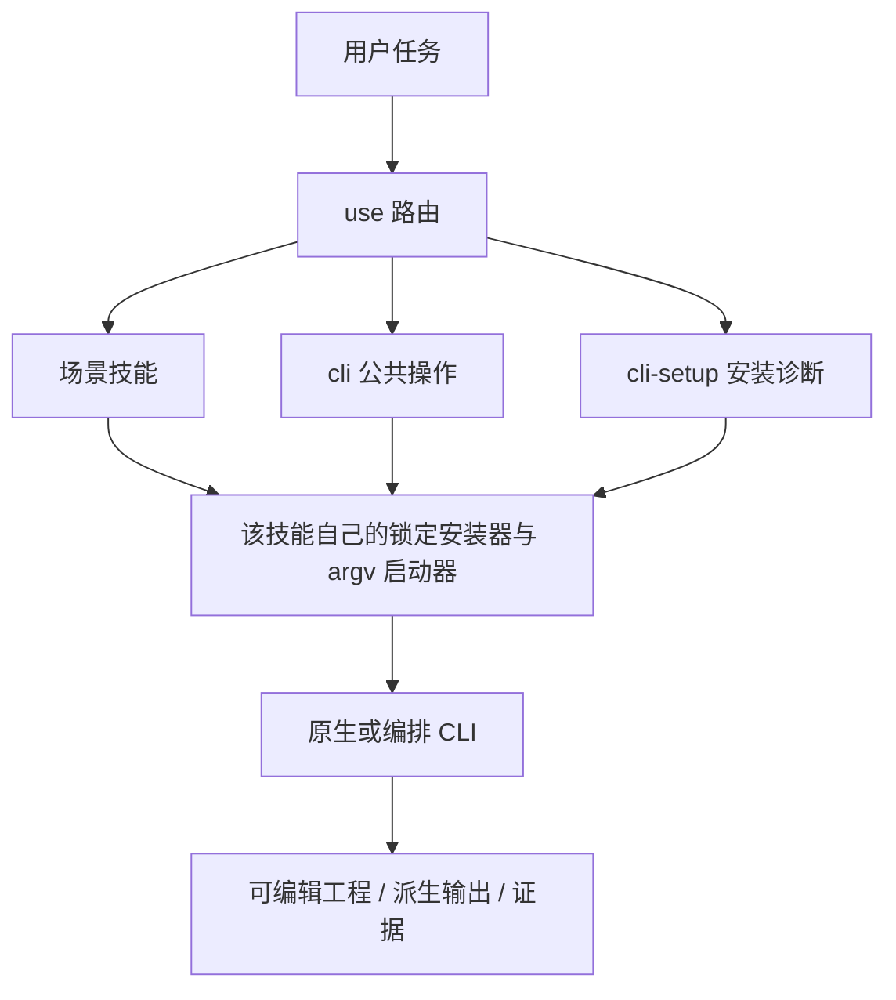

# PhotoCraft CLI 场景技能架构

> 更新：2026-10-05。技能源/插件开发版本：0.1.0-dev.3；原生/编排运行时：0.2.0。目标行为以既有 OpenSpec 变更为事实源。

## 1. 为什么拆分

原有单个 use 技能提供安装和原生代表流程，但触发范围过宽、场景路由不足。本次借鉴 Dreamina 的 use / CLI / setup / 任务分层，通过源码和实际运行时命令目录决定划分，不制造虚构 auth 或生成接口。本包包含 12 项技能。

## 2. 职责与路由

| 技能 | 任务边界 |
| :--- | :--- |
| `photocraft-use` | 组合多个本工具能力并保留可编辑原生交付 |
| `photocraft-cli` | 查询实际命令参数和能力，调用公开 CLI、MCP 与诊断 |
| `photocraft-cli-setup` | 首次安装、摘要校验、版本检查与缺失运行时排障 |
| `photocraft-cli-project` | 创建、打开和保存 pcraft，检查尺寸、深度和色彩模式 |
| `photocraft-cli-layers` | 组织产品、背景、文本与图层组，调整混合和层级 |
| `photocraft-cli-selection` | 创建选区、反选、羽化和局部选择 |
| `photocraft-cli-masks` | 建立图层蒙版、矢量蒙版与剪贴合成 |
| `photocraft-cli-adjustments` | 使用调整图层或指定局部颜色调整 |
| `photocraft-cli-retouch` | 对已授权图像做修复、克隆、画笔和局部修饰 |
| `photocraft-cli-text` | 创建和修改文字图层、字体、段落和布局 |
| `photocraft-cli-resize` | 调整画布和图像尺寸，制作海报封面变体 |
| `photocraft-cli-export` | 从原生图层工程输出 PSD、PNG 或其他交换文件 |



## 3. 单技能安装与 CLI 生命周期

每项技能自带必要脚本、运行时锁、工作流参考和实例；不存在兄弟目录读取或符号链接。仓库维护时通过 `scripts/sync_skill_suite.py` 从 use 技能同步共享执行资源，`--check` 拒绝漂移。场景描述与命令证据分别维护。发布资源适度重复以支持按粒度安装，共享代码不手工维护多套实现。

启动器接收 `--` 后的原生 argv，在安装前检查首个子命令，通过固定摘要的可执行文件调用且不使用 shell，保留退出码并有界等待。非法操作、不支持平台与损坏安装明确失败；命令 ID、参数和 enabled 状态运行时重查。超时是结果未知，不能证明写入未发生；先保留检查点、核对工程再决定后续操作。

## 4. 源码证据与工具差异

研究提交：`storytold/photocraft` 的 `f114f621799a96dc9f28ffb8faa01da680b64947`。CodeGraph 索引 605 文件、16264 节点、81661 边；分别检查 CLI 解析与引擎派发，并读取已安装运行时目录。当前源码与发布二进制可能不同，参见[研究证据](evidence/upstream-codegraph.json)。

FilmCraft 用 ticks 与 save/save-as；EffectCraft 使用 comp/layer 属性路径和渲染通道；PhotoCraft 的 run 参数按顺序绑定并可用 serve 保持会话；VectorCraft 按顺序执行 run/export 且画板/范围索引不同。上游 ArtCraft 是 Tauri 场景与生成应用，含素材保存和异步供应商任务通知。本项目 ArtCraft CLI 为独立实现的本地 DAG/账本运行时，不复制上游 ArtCraft 代码或品牌资源。

## 5. 验证与发布

`tests/test_skill_suite.py` 逐个隔离技能，核对固定 CLI 版本、命令目录子集和非法子命令在安装前被拒绝。既有原生工作流回归验证可编辑交付及修订。单项技能发现成功不代表每条场景命令、创作质量、GUI 或跨编辑器保真均通过。共享资源检查与每项 SKILL.md 校验分别执行；原生/平台和宿主证据分别记录。

在独立技能仓库运行：

```bash
python3 -B scripts/sync_skill_suite.py --check
python3 -B -m unittest discover -s tests -p test_skill_suite.py -v
CRAFT_LIVE_SUITE=1 python3 -B -m unittest discover -s tests -p test_skill_suite.py -v
```

单项安装：`npx skills add full-aigc-skills/photocraft-skills --skill <skill-name>`，使用其实际绝对路径执行，不读取兄弟技能。插件固定完整技能清单的来源标签、提交和逐项摘要；旧发布标签不可变，原 use/workflow payload 保持兼容。
