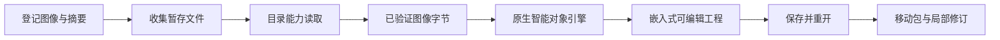

# PhotoCraft 智能对象内容架构

## 状态与事实源

本文件记录实施检查点，不声明已发布能力。行为由 OpenSpec PC-DM-001-SMART、PC-RT-002-SMART 管理。真实首用暴露官方 0.2.0 运行时拒绝环境智能对象文件命令，维护版构建与候选真实首用仍待完成。

## 公开工作流

`asset.placeSmart` 接受登记图像别名及可选 center、fit、scale；转换与嵌入要求显式图层 ID 或显式结果引用。替换／重新链接使用 `{layer, asset}`。任意路径、未知字段、非法图层和非有限几何参数拒绝；执行器仅生成收集目录内的相对文件名。

## 运行时边界

维护版补丁仅为嵌入放置和内容替换提供目录能力读取，向已有引擎接口传递字节，原环境路径守卫保留。重新链接收集为嵌入替换；嵌入操作拒绝读取未登记的旧外部链接。绝对路径、逃逸路径和符号链接拒绝；检查输出增加源类型与变换，不暴露外部路径。

## 交付与验收

输入摘要保留在素材清单。原生门禁检查旧包与移动包、智能对象变换、蒙版、非目标图层、三份独立解码像素及非法路径拒绝。持久外部链接、全部智能滤镜、外部 PSD 编辑需要单独验收。[检查点证据](evidence/smart-workflow-checkpoint-20261006.json)记录官方运行时首用失败、三项输入回归通过和 46 项候选自动化测试通过。构建成功不能单独关闭安装或可编辑交付门禁。

固定 Photo 插件 dev.11／技能源 dev.10／CLI 0.2.0-craft.1 的安装后领域验收现已通过；Art 混合升级仍待完成。 [Evidence / 证据](evidence/codex-photocraft11-smart-first-use-20261006.json)。
