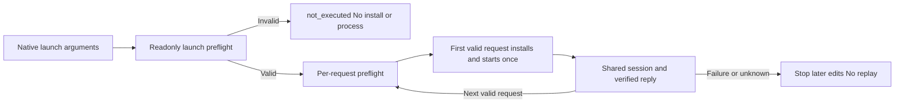

# Stream launch preflight

PC-TX-005 pre-install validation now covers launch configuration for public `cli.py mcp` and `cli.py serve` stdio. Invalid roots, missing recognized option values, non-loopback bridge addresses and missing, invalid or conflicting bridge credentials fail before reading input or invoking the installer. Structured validation errors expose codes and field paths without credential values or file contents. Client preflight never creates token files.

Pinned native Args compatibility is preserved: equals or separate values, last assignment, ignored options and positional arguments, and ignored subcommand help flags. Only active configuration is checked. Headless MCP and stdio serve check roots; bridge MCP checks loopback and client credentials while ignoring headless roots. Non-bridge credentials remain ignored. CLI values override the corresponding environment values, while cross-source token/file conflicts remain errors. Relative directories and valid root symlinks remain supported; tilde expansion is not introduced.

The native process still verifies directory capabilities and actual connections at use time. Preflight does not establish future filesystem stability, connectivity or server credential acceptance. Existing TCP launch validation remains independent.

Create, edit, save and inspect requests in one input stream share one native process. Native tests assert one child per protocol and cleanup at stream completion, without starting a GUI. This increment does not implement desktop reuse across separate invocations or establish a FilmCraft fix. Task9.6, shared desktop writing and full V1 remain open.

`tests/test_stream_launch.py` covers13 independent skills,208 public startup refusals, validation before consuming input, legacy option compatibility and two native shared-session save workflows. Native tests require explicit `CRAFT_NATIVE_COMMANDS=1` and an isolated `CRAFT_RUNTIME_HOME`.
