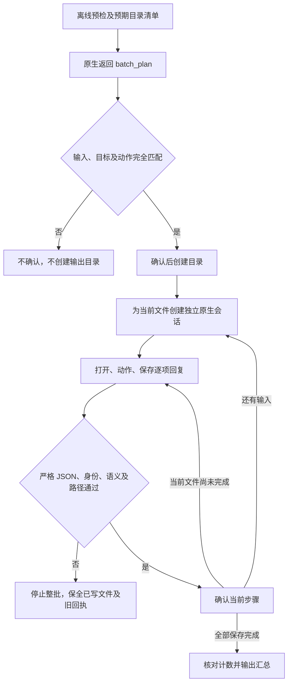

# 原生 batch 逐条确认候选

本候选继续 OpenSpec `establish-v1-plugin` 的 PC-TX-005／任务 9.6。运行时 `0.2.0-craft.3` 在原 run 监督候选基础上加入 batch；公开技能 dev.41、插件 dev.47、运行时 craft.1、公开 `cli.py` 与插件快照不变。本接口尚未作为公开入口接入。

## 清单、操作与输出

监督模式先读取动作、枚举并排序输入，发出 `batch_plan`。清单同时绑定输入／目标文件和规范化动作，收到确认后才创建输出目录。监督器按固定上游 `f114f621799a96dc9f28ffb8faa01da680b64947` 的 codec 规则独立计算预期清单，拒绝缺项、错配或动作变化。AVIF 的读取能力为 false，不选入批处理；目录、无扩展及其他不支持扩展同样不选入。

每个文件继续创建独立的 `Headless::trusted_local` 会话，依次确认打开、每条动作及最终保存。完整保存回复验证且返回路径匹配后才输出原有 `ok    input -> target` 行。所有文件确认后核对 `batch_complete` 的成功／失败数，输出原来的汇总。默认扩展、显式 format、quality、路径拼写和原动作元数据保持原生规则，不改走 MCP 的目录能力模型。



任何不明确或明确失败回复都停止监督整批，不能继续其他文件或重放已发送操作。普通 batch 不启用 `--supervised` 时，仍保持原来的逐文件失败后继续、打印失败行和最终汇总的行为。两种行为均有真实原生比较用例；监督模式的停止行为是 PC-TX-005 的目标变更。

监督器还修复了正常回复后附带额外帧的问题：原生正在等待确认时不能合法发出下一帧，已经读入的多余数据须在追加回执和确认之前拒绝。保存回复返回其他路径也不再被接受。

## 构建与验证

`runtime/supervised-batch-patch.json` 和对应补丁保留前一版 run 及 scoped-smart-content 逻辑；研究仓库只读，普通 batch 路径原样保留。仅验证 macOS arm64。

```bash
python3 -I -B scripts/build_smart_runtime.py \
  --repository ../../research/photocraft \
  --output /absolute/new-candidate-directory \
  --manifest supervised-batch-patch.json --version 0.2.0-craft.3
CRAFT_SUPERVISED_BINARY=/absolute/candidate/photocraft-cli \
  python3 -I -B -m unittest discover -s runtime/tests -p 'test_*.py' -v
```

58 项构建 Rust 测试通过，20 项 run／batch 定向测试通过。batch 新增 10 项方法覆盖预检、codec 清单、原生排序及独立会话、保存后未确认、明确失败、旧输出／格式／质量参数、空输入与合法路径拼写，以及实际保存后六种回复故障。每种保存故障都检查当前文件原路径重开、源文件摘要不变、后续文件／编辑／最终汇总为零。非法清单和非法计划分别在确认前和进程前拒绝。

初次路径拼写用例使用了尚不存在且末尾为 `/.` 的输出目录；固定 Rust 原生实现本身即拒绝此组合。修正 fixture 为已存在目录，并先验证普通原生 batch 成功，再比较监督输出；未改变原生实现或验收要求。

## 保持开放的门禁

`execute` 是候选内部接口，调用方必须先绑定上述受支持二进制及来源摘要。旧原生 CLI 会忽略未知监督标志，不能尝试执行后再判断兼容性。公开接入需要安装前能力／来源判断、固定锁和持久恢复回执，不能仅传一个任意可执行文件路径。完整固定安装、droplet 内部步骤、MCP／serve 流式、全入口及逐命令矩阵仍开放；9.6 不勾选，不发布替换当前运行时。
