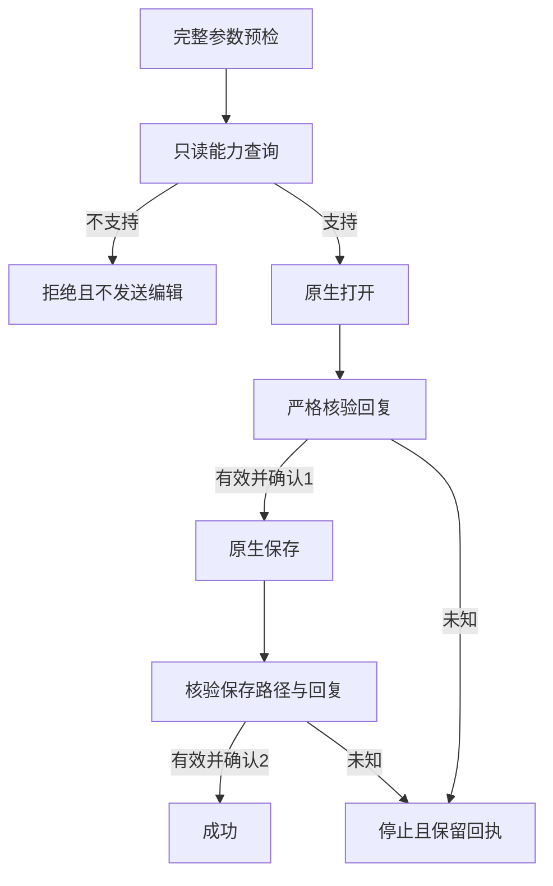

# PhotoCraft 转换监督候选

源 dev.42 包含独立的 run／batch／convert 监督执行器和 craft.4 维护补丁。公开 cli.py 仍使用固定 craft.1；本次发布不自动启用候选运行时，也不声明固定安装或完整 PC-TX-005 验收。

执行器先预检完整计划，再查询只读 --supervision-info 元数据。协议、所需子命令或确认格式缺失时，在发送编辑请求前以 supervision_unavailable／not_executed 拒绝。能力元数据不能替代二进制来源和摘要验证；调用者仍须核验运行时身份。

convert 保留原生 files::open/save 与质量、格式行为。打开结果经严格核验并确认序号1后才保存；保存结果确认序号2后才成功返回。错误、重复键、非有限值、错路径及额外回复均停止确认，不重放。保存已经发生时保留原始产物和 unknown 回执，不能声称未执行。

复现：使用 scripts/build_smart_runtime.py，传入 --manifest supervised-convert-patch.json --version 0.2.0-craft.4；以 CRAFT_SUPERVISED_BINARY 指向构建出的二进制执行 runtime/tests。构建默认离线，公开运行时锁不变。

候选定向30项测试及维护版58项Rust测试通过，包括旧公开运行时能力缺失零编辑、四格式转换和六种真实保存后故障。完整源码回归与发行证据在插件仓记录。droplet、流式、公开入口接入、持久恢复、固定安装及完整逐命令矩阵仍开放，9.6不勾选。
