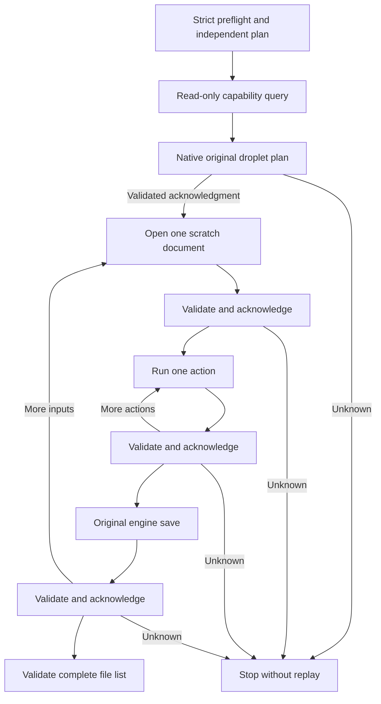

# PhotoCraft supervised droplet candidate

Source dev.43 packages the craft.5 droplet supervisor candidate; plugin dev.49 pins these modules. Public cli.py still uses locked craft.1; the craft.5 native runtime is not activated or fixed-installed.

The engine's original droplet parser and plan preparation are shared with ordinary execution. The supervised path uses the same read_file, import, scratch Session, action commands and save_doc. It retains the engine's 0–12 JPEG quality scale, options/CLI output precedence, format normalization, ordered file/directory inputs and repeated inputs. Ordinary execution still collects per-file errors and continues.

A read-only plan frame binds every normalized action and input/target before any document is opened or output is created. Each open, action and save requires a strictly validated acknowledgment; any invalid reply or native failure stops the supervised droplet entirely. After a save fault, the real output and unknown request receipt are retained; subsequent files are untouched and editing is never replayed. Healthy stdout retains the original `ok    target` lines.

Reproduce with scripts/build_smart_runtime.py --manifest supervised-droplet-patch.json --version 0.2.0-craft.5. Set CRAFT_SUPERVISED_BINARY to the built binary and CRAFT_SUPERVISED_VERSION=0.2.0-craft.5 when running runtime/tests. Research remains read-only; the patch is applied in a temporary checkout of the pinned upstream.

Validation evidence is recorded in the plugin's supervised-droplet evidence directory. Streaming, nested aggregate-command internals, public CLI/runtime provenance integration, persistent recovery and fixed candidate installation remain open. No task is closed from this partial candidate.

Forty focused methods (zero skips) and58 Rust tests pass. The changed-quality RED is an actual native save before refusal; the final native plan binds quality and the GREEN observes only sequence1 with no acknowledgment or output. JPEG bytes and dimensions match published craft.1; six actual post-save fault cases preserve original inputs and reopened outputs. Full source regression is recorded separately in plugin evidence.
