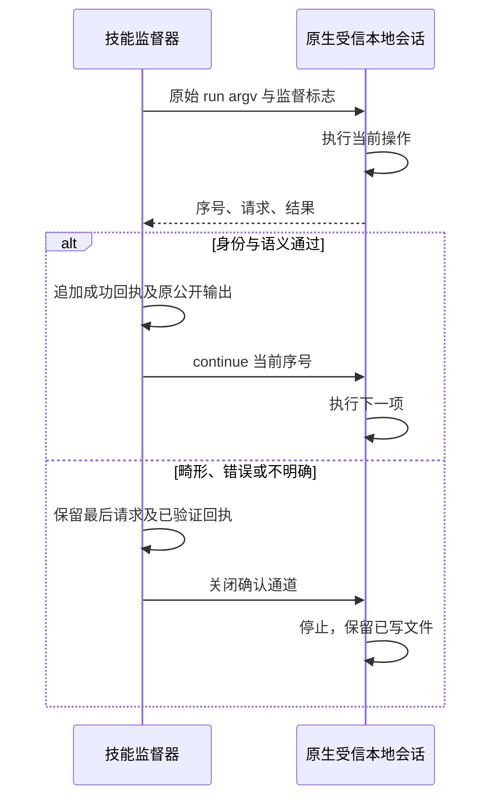

# 原生 run 逐条确认候选

本候选推进 OpenSpec `establish-v1-plugin` 的 PC-TX-005／任务 9.6。它不是新的公开运行时或完整入口验收。当前公开技能源 dev.41、插件 dev.47 和运行时 `0.2.0-craft.1` 不变；公开 `cli.py` 尚未接入候选监督器。

## 执行边界

旧 CLI 在同一进程内执行整个 `run`，包装脚本事后读取 stdout 无法保证阻止下一项编辑。直接改用现有 MCP 会改变受信本地路径、目录能力、文件型引擎命令与部分保存行为，因此本候选在固定上游的原始 `Headless::trusted_local` 会话中添加显式 `--supervised` 模式。

每次新建、打开、命令或最终保存结束后，原生进程发出一条 `photocraft-supervised-run/v1` 事件，包含递增序号、工具、原请求参数、结果或错误以及原输出是否可见。成功事件须收到精确的 `continue <sequence>\n` 才继续；EOF、拒绝、错误序号、额外内容或超长确认均停止。原生操作已经执行，停止或断线不意味着未执行，也不撤销已保存文件。引擎明确失败直接停止，不等待确认。

`cli_supervisor.py` 由已预检 argv 计算预期事件，用严格 JSON 拒绝重复键与非有限值，逐项核对请求身份，再复用普通工作流的回复语义。只有通过校验的命令结果才输出原来的 `{"command":...,"result":...}` 行并确认。异常携带已验证回执和最后请求，绝不自动重试。该模块目前是候选内部接口；调用方仍须校验二进制锁，并在正式接入时持久化恢复记录。



## 构建与复验

`runtime/supervised-run-patch.json` 固定上游提交 `f114f621799a96dc9f28ffb8faa01da680b64947`。补丁包含既有 scoped-smart-content 修复及 CLI 确认边界，不修改 research 仓库，不变更 MCP 权限。候选版本为 `0.2.0-craft.2`；仅 macOS arm64 构建。

```bash
python3 -I -B scripts/build_smart_runtime.py \
  --repository ../../research/photocraft \
  --output /absolute/new-candidate-directory \
  --manifest supervised-run-patch.json --version 0.2.0-craft.2
```

默认离线。依赖缓存缺失时可显式添加 `--online` 让 Cargo 获取构建依赖。构建运行 automation 与 CLI 的 Rust 测试，并输出带补丁、上游、Cargo.lock 和制品摘要的构建回执。

```bash
CRAFT_SUPERVISED_BINARY=/absolute/candidate/photocraft-cli \
  python3 -I -B -m unittest discover -s runtime/tests -p 'test_*.py' -v
```

当前定向验收覆盖 10 项测试：未确认新建／命令停止、错误确认、原生失败、合法新建与另存修订、旧 stdout 兼容、保存后无确认保全、实际回复后重复键／非有限值／语义错误／请求身份故障，以及最终保存回复畸形后的原路径重开。另有真实 `file.saveACopy` 写出 PSD 后注入重复键或语义错误的两例：后续编辑和最终保存次数均为零，源 `.pcraft` 与保存的 PSD 保全。PSD 证据只覆盖本测试实际内容，不代表完整外部编辑器保真。

## 尚未完成

公开 CLI 接入与持久恢复回执、batch／droplet 内部步骤、MCP／serve 流式合同、固定发行安装副本、完整入口矩阵及完整命令验收仍开放。未更新公开锁、发布标签、插件受管理快照或市场资格；任务 9.6 不勾选。
