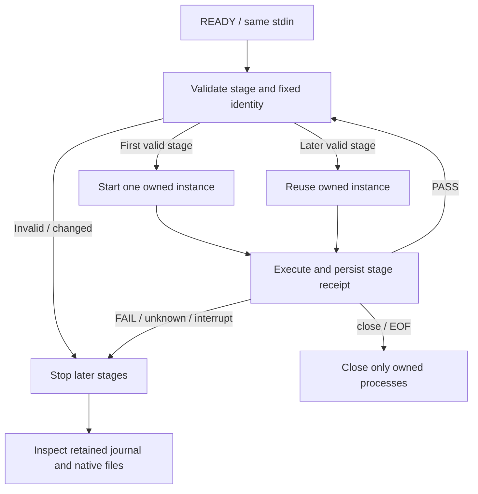

# PhotoCraft task sessions

PC-TX-001-SESSION；对应插件 OpenSpec 3.3／10.6 及公开入口9.6，完整验收保持开放。


同一用户任务的检查、编辑、保存、关闭自有工程、重开和继续修订，使用本技能 `scripts/task_session.py`，保持同一前台进程和输入句柄。每阶段不要重新运行 `commands.py run` 或 `desktop.py run`；这两个兼容入口仍按单次调用清理自己拥有的实例。

Keep one foreground task_session.py process and the same stdin handle for all stages of a user task. The existing single-run commands.py and desktop.py entry points keep their original lifecycle.

## 启动一次 / Start once

`SKILL_DIR` 来自实际加载的技能目录；`TASK_OUTPUT` 是授权输出根内尚不存在的任务目录；`RUNTIME_HOME` 是已授权的运行时安装／缓存根。先设定这些真实值，不将安装目录用作创作输出。

```bash
: "${SKILL_DIR:?Set the actual loaded skill directory}"
: "${TASK_OUTPUT:?Set a new task directory under an authorized output root}"
: "${RUNTIME_HOME:?Set the authorized runtime cache}"
python3 -I -B -u "$SKILL_DIR/scripts/task_session.py" \
  --output "$TASK_OUTPUT" --runtime-home "$RUNTIME_HOME" --mode bridge
```

`bridge` 拥有一个新的签名桌面及 MCP 桥接；`headless` 不启动桌面。`READY` 后向同一句柄逐行写请求；首份合法计划才创建任务目录、校验／复用安装并启动原生实例。需要外部素材或源工程时，在启动命令添加 `--protect-input <真实文件或目录>`，可重复声明。每阶段 `inputs` 是名称到已登记文件路径的映射；先复制、核对摘要，再让原生实例访问任务内副本。注册范围不是宿主权限适配或操作系统沙箱的替代。

Bridge owns one signed desktop and one MCP connection; headless owns only MCP. READY precedes output creation and native startup. Register external inputs with --protect-input at startup. Each stage copies and hashes inputs into its own directory before native access. Registration does not establish OS sandbox or complete host permission acceptance.

## 连续阶段 / Incremental stages

每行一个 `name`、`plan` 和可选 `inputs` 对象。`name` 是本任务内新的阶段名：字母开头，字母／数字／下划线／短横线，最多64字符。计划仍遵循 `craft-command-plan/v1`。读取完整回执再发送下一份计划，直接使用真实返回的文档／图层 ID；`as`／`$ref` 别名只在当前计划内有效。

```json
{"name":"create","plan":{"schema":"craft-command-plan/v1","operations":[{"command":"file.new","params":{"width":16,"height":16,"mode":"rgb","depth":8}},{"tool":"doc_save","params":{"path":{"$output":"project.pcraft"}}}]}}
{"name":"revise","plan":{"schema":"craft-command-plan/v1","operations":[{"command":"layer.new.layer","params":{"name":"Revision"}},{"tool":"doc_save","params":{"path":{"$output":"project.pcraft"}}}]}}
```

原生读写根固定为 `TASK_OUTPUT`。`$output` 在两阶段分别解析为 `create/project.pcraft` 与 `revise/project.pcraft`；已复制输入也带所属阶段前缀。普通字面路径相对于任务根，重开原版可以使用 `create/project.pcraft`。保存新检查点使用当前阶段的 `$output`，不要用旧版路径保存来覆盖检查点。原生会话持续存在不表示任意旧计划可以继续写；每阶段重新核对资源、二进制、完整能力快照及实际命令 enabled 状态。

Native roots remain at TASK_OUTPUT. $output and copied input references resolve beneath the current stage; literal paths are relative to the task root. Open an earlier checkpoint by its stage-relative path, and save new checkpoints with the current stage's $output. Resource, binary, full capability and actual enabled-state checks run before later edits.



## 结束和未知结果 / Finish and unknown outcomes

```json
{"action":"close"}
```

关闭工程是计划步骤，不是结束应用；`close`、EOF 或中断才结束本任务。保存始终显式执行，结束不自动保存或导出。失败、unknown、进程退出或身份变化后，后续阶段拒绝执行，不自动重启或重放。并发阶段返回 `task_session_busy`；关闭进行中也不接受新的写入。清理失败可再次清理原所属进程，不新建替代实例。

Close a document through an explicit plan; close, EOF or interruption ends the task. Saving is explicit. Failure, unknown results, process exit or changed identity stops later stages without restart or replay. Concurrent stages and writes during close are refused; cleanup retries only the original owned processes.

`task-session.json` 记录任务身份、实际 PID、启动数、各阶段计划／回执摘要和清理结果。它不是 Harness 账本，不自动接管用户已有应用，也不证明共享可变工程的原子写入权、取消后全部子进程退出、跨进程恢复、创作质量或全部命令验收；这些现有门禁继续分别验证。

The receipt records task identity, actual PIDs, startup count, stage identities and cleanup. It is not a Harness ledger, attachment to a user-owned app, or proof of shared mutable ownership, complete cancellation/recovery, creative quality or all-command acceptance.
