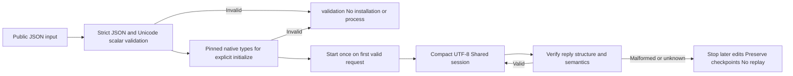

# MCP initialization and Unicode wire boundaries

This increment continues PC-TX-005 without reducing the full task9.6 matrix.

Initialization types come from rmcp3.5.0 pinned in upstream commit `f114f621799a96dc9f28ffb8faa01da680b64947`, crate SHA-256 `fae7019994ae0fe4ada40b732f798f3ff26f0f04facb1477f1bf37eb4f18a2d3`. The [immutable dependency source](https://static.crates.io/crates/rmcp/rmcp-3.5.0.crate) was read, not installed; relevant files are `model.rs`, `model/capabilities.rs` and `service/server.rs`. The native runtime is unchanged.

Explicit initialize requests validate required protocolVersion, capabilities and clientInfo types before installation, including known optional capabilities and icon fields. Optional nulls, native negotiation of unknown version strings, ignored fields and extension settings remain compatible. Clients using per-request metadata are not forced into the legacy handshake. Native connections and authorization remain native responsibilities.

Strict JSON rejects unpaired surrogate escapes while preserving valid pairs, Chinese and emoji. Duplicate-key, nonfinite, depth and Unicode errors carry fieldPath separately from display text, so quoted keys containing `expected` or `=>` do not truncate locations. Ordinary tool text retains JSONDecodeError syntax compatibility.

Serve's1MiB request budget counts UTF-8 bytes. Compact UTF-8 forwarding avoids expanding valid Chinese IDs into ASCII escape sequences. An actual serve stream with180,000 Chinese characters plus an emoji in its ID queries, creates, saves, reopens and inspects using one native process. Native MCP stdio has no equivalent1MiB input limit; none is added here.

Tests cover429 invalid initializations and65 public Unicode refusals across13 standalone skills, plus actual extended-handshake and per-request-metadata MCP modes. Malformed Unicode replies after real MCP/serve saves stop later edits and preserve source/checkpoint files. No GUI is launched; desktop reuse across separate invocations is not implemented by this increment.

Fixed installation is verified separately. The complete public matrix remains open, including other lifecycle messages, numeric re-encoding size boundaries and Harness entry audit. These focused cases do not close task9.6 or fullV1.
