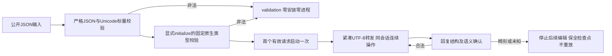

# MCP初始化与Unicode线路边界

本增量继续PC-TX-005，不减少9.6的完整输入矩阵。

初始化类型来源为固定上游commit `f114f621799a96dc9f28ffb8faa01da680b64947` 的Cargo.lock：rmcp3.5.0，crate SHA-256 `fae7019994ae0fe4ada40b732f798f3ff26f0f04facb1477f1bf37eb4f18a2d3`。参考[固定依赖源码包](https://static.crates.io/crates/rmcp/rmcp-3.5.0.crate)的 `model.rs`、`model/capabilities.rs` 和 `service/server.rs`；只读取源码，没有安装依赖或修改原生运行时。

`initialize`在安装前校验protocolVersion、capabilities及clientInfo必填类型，并检查原生已知的能力、图标和可选字段。合法null可选项、未知协议字符串的原生协商、原生忽略字段及扩展设置保持兼容。不强制逐请求元数据客户端使用旧初始化握手；原生连接及服务端授权仍由原生负责。

严格JSON拒绝未配对的高／低代理转义，并保留合法配对、中文和emoji。重复键、非有限值、深度及Unicode错误携带独立fieldPath，不再从包含任意键名的错误正文截取路径；字段名中的`expected`或`=>`不会截断位置。普通工具文本的JSON语法错误仍保持JSONDecodeError兼容。

serve的1MiB请求限制按原生UTF-8字节计数。转发采用紧凑UTF-8 JSON，避免将合法中文ID扩大成ASCII转义。180,000个汉字和一个emoji的ID经真实serve完成查询、创建、保存、重开及检查，只启动一个原生进程。MCP原生stdio没有相同1MiB输入限额，本增量不添加该限制。

测试覆盖13技能的429个初始化负例、65个公开入口Unicode负例；另验证扩展初始化和逐请求元数据两种真实MCP模式。MCP／serve保存后的畸形Unicode回复停止后续编辑并保全原工程和已保存检查点。测试不启动GUI，桌面跨调用复用不由本增量实现。

固定安装复验独立记录。完整公开输入矩阵继续开放，尤其仍需审计其他协议生命周期、任意数值在重新编码后的大小，以及Harness入口；不以这些定向用例关闭9.6或完整V1。
